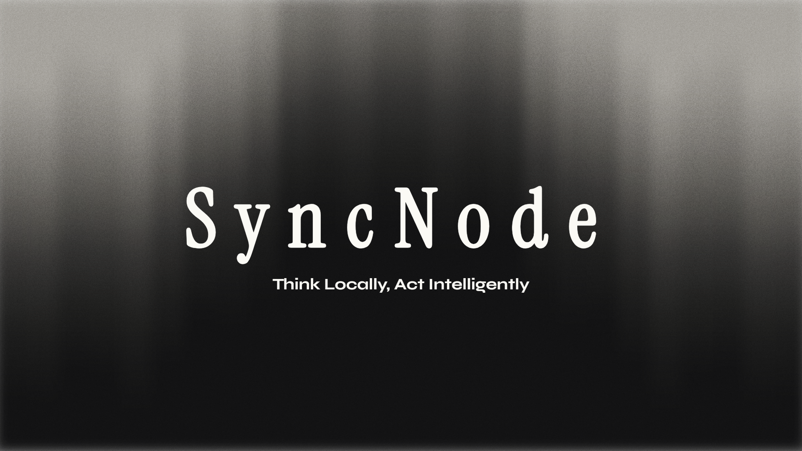

<div align="center">



<br/>

# SyncNode

### Think locally. Act intelligently.

**A sovereign, fully offline AI automation workbench for Windows.**
No cloud. No subscriptions. No data leaving your device.

<br/>

[](https://github.com/Boredooms/SyncNode/actions/workflows/build.yml)
[](https://github.com/Boredooms/SyncNode/releases/latest)
[](https://github.com/Boredooms/SyncNode)
[](https://ollama.com)
[](./LICENSE)

<br/>

[**Download**](https://github.com/Boredooms/SyncNode/releases/latest) &nbsp;·&nbsp; [**Quick Start**](#quick-start) &nbsp;·&nbsp; [**Architecture**](#architecture) &nbsp;·&nbsp; [**Docs**](./docs/) &nbsp;·&nbsp; [**Website**](./website/)

</div>

---

## What is SyncNode?

SyncNode is a **local-first AI agent workbench** that turns a natural-language goal into a durable, observable, permissioned workflow — running entirely on your GPU, inside your machine.

You type a goal. SyncNode understands it, decomposes it into steps, assigns specialized agents, executes tools on your real Windows desktop, verifies every result, and pauses for your approval before sending anything outside. Every step is audited with an immutable SHA-256 chain. Nothing leaves your device.

---

## What it can do

| Capability | Details |
|---|---|
| **Create Office documents** | Word (.docx), Excel (.xlsx), PowerPoint (.pptx) with real written content |
| **Control your desktop** | Open apps, type into them, click controls via Windows UI Automation |
| **Browse the web** | Navigate Chromium, fill forms, attach files, interact with web apps |
| **Compose emails** | Fill recipient, subject, body, attach files — then pause for your approval |
| **Access your whole PC** | Read/write files, run shell commands, list processes, manage the filesystem |
| **Chat intelligently** | Ask questions, trigger actions, query your local knowledge base |
| **Multi-agent coordination** | Supervisor, Writer, Document, Office, Computer, Browser, Verifier, Recovery agents |
| **Verify everything** | Post-condition assertions after every tool call — file exists, window open, field filled |
| **Learn over time** | Workflow memory records successful patterns for future runs |
| **Audit everything** | SHA-256 immutable audit chain across every event, tool call, and decision |

All inference runs on your GPU via Ollama. No API keys. No internet required after setup.

---

## Architecture

```
+----------------------------------------------------------+
|                   Electron Frontend                       |
|  React 18 + TypeScript + Tailwind + Framer Motion        |
|  Home · Runs · Chat · Knowledge · Settings               |
|  Live SSE stream · Agent inspector · Artifact evidence   |
+----------------------------+-----------------------------+
                             | HTTP + SSE  localhost:8000
+----------------------------v-----------------------------+
|                  FastAPI Backend                          |
|  LangGraph orchestrator: intent -> plan -> agents        |
|  44 registered tools (document, system, browser, office) |
|  Post-condition verification engine                       |
|  SHA-256 audit chain per event                           |
|  SQLite (aiosqlite) + ChromaDB RAG (offline embeddings)  |
|  Approval gateway for external/destructive actions       |
+----------------------------+-----------------------------+
                             | HTTP  localhost:11434
+----------------------------v-----------------------------+
|                  Ollama (local)                           |
|  gemma4:e4b  — primary model (GPU, Q4_K_M, 8B, 128k ctx)|
|  gemma3:1b   — enricher + summarizer (CPU fallback)      |
+----------------------------------------------------------+
```

### Execution flow

```
Natural language goal
  -> Context collection
  -> Intent extraction
  -> Task decomposition (LangGraph DAG)
  -> Agent spawning + routing
  -> Local model inference (Ollama / gemma4:e4b)
  -> Tool execution (deterministic)
  -> Real computer interaction (UIA + Playwright)
  -> Observation capture
  -> Post-condition verification
  -> Recovery / re-planning if needed
  -> Human approval gate (external side effects)
  -> Auditable result + workflow memory
```

> The model proposes. Deterministic infrastructure validates, authorizes, executes, and verifies.

---

## Tool surface (44 tools)

| Category | Count | Examples |
|---|---|---|
| Document & filesystem | 7 | `create_word_document`, `read_file`, `write_file`, `list_directory` |
| Computer / UIA | 9 | `search_taskbar`, `click_element`, `type_text`, `take_screenshot` |
| Browser / Playwright | 8 | `navigate`, `fill_field`, `click`, `attach_file`, `get_page_content` |
| Office (Excel + PowerPoint) | 8 | `create_workbook`, `add_sheet`, `create_presentation`, `add_slide` |
| System | 12 | `run_shell`, `list_processes`, `get_env`, `search_files` |

---

## Requirements

| Component | Minimum | Recommended |
|---|---|---|
| OS | Windows 10 x64 | Windows 11 x64 |
| RAM | 8 GB | 16 GB |
| GPU | Any (CPU fallback) | NVIDIA RTX (4 GB+ VRAM) |
| Storage | 10 GB free | 20 GB free |
| Python | 3.12 | 3.12 |
| Node.js | 20 | 20 |

---

## Quick Start

### 1. Install Ollama

Download from [ollama.com](https://ollama.com) and install. Then pull the models:

```powershell
ollama pull gemma4:e4b    # Primary model — ~9.6 GB
ollama pull gemma3:1b     # Enricher/summarizer — ~800 MB (optional)
```

### 2. Clone and install

```powershell
git clone https://github.com/Boredooms/SyncNode.git
cd SyncNode

# Python backend + AI substrate
pip install -e backend -e ai_ml

# Electron frontend
cd frontend/electron
npm install
cd ../..
```

### 3. Configure

```powershell
Copy-Item .env.example .env
# Defaults work out of the box — edit only if you need custom paths or ports
```

### 4. Start

```powershell
# All-in-one (recommended)
.\scripts\start_all.ps1 --dev

# Manual — 3 separate terminals
.\scripts\start_ollama.ps1              # Terminal 1
python scripts\start_server.py          # Terminal 2
cd frontend/electron && npm run dev     # Terminal 3
```

Electron auto-connects to the backend. The splash screen runs startup checks, then opens the workbench.

---

## Building the distributable

```powershell
# Build backend executable (PyInstaller)
.\scripts\build_backend.ps1

# Build Electron NSIS installer
cd frontend/electron
npm run dist
# Output: frontend/electron/dist/SyncNode-Setup-1.0.0.exe
```

### CI/CD

Every push to `main` and every `v*.*.*` tag triggers [`.github/workflows/build.yml`](.github/workflows/build.yml):

1. Backend linting + frontend TypeScript checks
2. PyInstaller bundles the backend into a standalone `.exe`
3. Electron NSIS packages the full installer
4. On version tags: GitHub Release published with installer attached

---

## Project structure

```
SyncNode/
+-- backend/                   FastAPI backend (Python 3.12)
|   +-- src/syncnode_backend/
|       +-- api/v1/            REST endpoints + SSE streaming
|       +-- workflow/          LangGraph orchestrator
|       +-- tools/             Tool registry (44 tools)
|       +-- system/            Full PC access tools
|       +-- computer/          Windows UIA desktop control
|       +-- browser/           Playwright browser automation
|       +-- office/            Excel / PowerPoint tools
|       +-- documents/         Word / filesystem tools
|       +-- verification/      Post-condition assertion engine
|       +-- audit/             SHA-256 audit chain
|       +-- policy/            Approval + risk classification
|       +-- knowledge/         ChromaDB RAG layer
|
+-- ai_ml/                     AI substrate (Python)
|   +-- src/syncnode_ai/
|       +-- gateway/           Ollama adapter
|       +-- intent/            Intent extraction
|       +-- planner/           LangGraph DAG planner
|       +-- agents/            Agent registry
|       +-- routing/           Inference profiles
|
+-- frontend/electron/         Electron + React 18
|   +-- src/
|       +-- main/              Electron main process
|       +-- preload/           Secure IPC bridge
|       +-- renderer/          React UI
|           +-- screens/       All application screens
|           +-- components/    Shared component library
|
+-- docs/                      Full technical documentation
+-- website/                   Promotional content + product docs
+-- shared/                    OpenAPI spec, event schemas
+-- scripts/                   Startup, build, benchmark scripts
+-- tests/                     Integration + golden-path tests
+-- data/                      SQLite DB + ChromaDB (gitignored)
+-- workspace/                 Run artifacts (gitignored)
```

---

## GPU troubleshooting (NVIDIA)

If you see `llama-server GPU discovery watchdog timed out`:

```powershell
# Set automatically by start_server.py and start_ollama.ps1
$env:CUDA_VISIBLE_DEVICES     = "0"     # Force discrete GPU 0
$env:OLLAMA_IGPU_ENABLE       = "0"     # Disable Intel iGPU Vulkan probe
$env:OLLAMA_LOAD_TIMEOUT      = "300s"  # Allow more CUDA init time
$env:OLLAMA_MAX_LOADED_MODELS = "1"    # Prevent parallel CUDA init deadlock
$env:OLLAMA_KEEP_ALIVE        = "30m"  # Keep model warm between steps
```

The startup scripts set all of these automatically.

---

## Documentation

| Document | Description |
|---|---|
| [`docs/idea.md`](docs/idea.md) | Full technical blueprint and architecture |
| [`docs/AI_BRAIN.md`](docs/AI_BRAIN.md) | LangGraph orchestrator deep-dive |
| [`docs/API.md`](docs/API.md) | REST + SSE API reference |
| [`docs/FINAL_TOOL_CATALOG.md`](docs/FINAL_TOOL_CATALOG.md) | All 44 tools documented |
| [`docs/LANGGRAPH_EXECUTION_MODEL.md`](docs/LANGGRAPH_EXECUTION_MODEL.md) | Execution DAG model |
| [`docs/END_TO_END_VERIFIER_WORKFLOW.md`](docs/END_TO_END_VERIFIER_WORKFLOW.md) | Verification + audit workflow |
| [`docs/FINAL_SECURITY_MODEL.md`](docs/FINAL_SECURITY_MODEL.md) | Policy, approval, and security design |
| [`docs/INFERENCE_OPTIMIZATION.md`](docs/INFERENCE_OPTIMIZATION.md) | GPU tuning and performance |
| [`docs/MULTI_AGENT_ARCHITECTURE.md`](docs/MULTI_AGENT_ARCHITECTURE.md) | Agent registry and coordination |
| [`website/`](website/) | Promotional site, roadmap, feature pages |

---

## License

Proprietary. All rights reserved. &copy; 2026 Boredooms.

---

<div align="center">

*Think locally. Act intelligently.*


</div>
