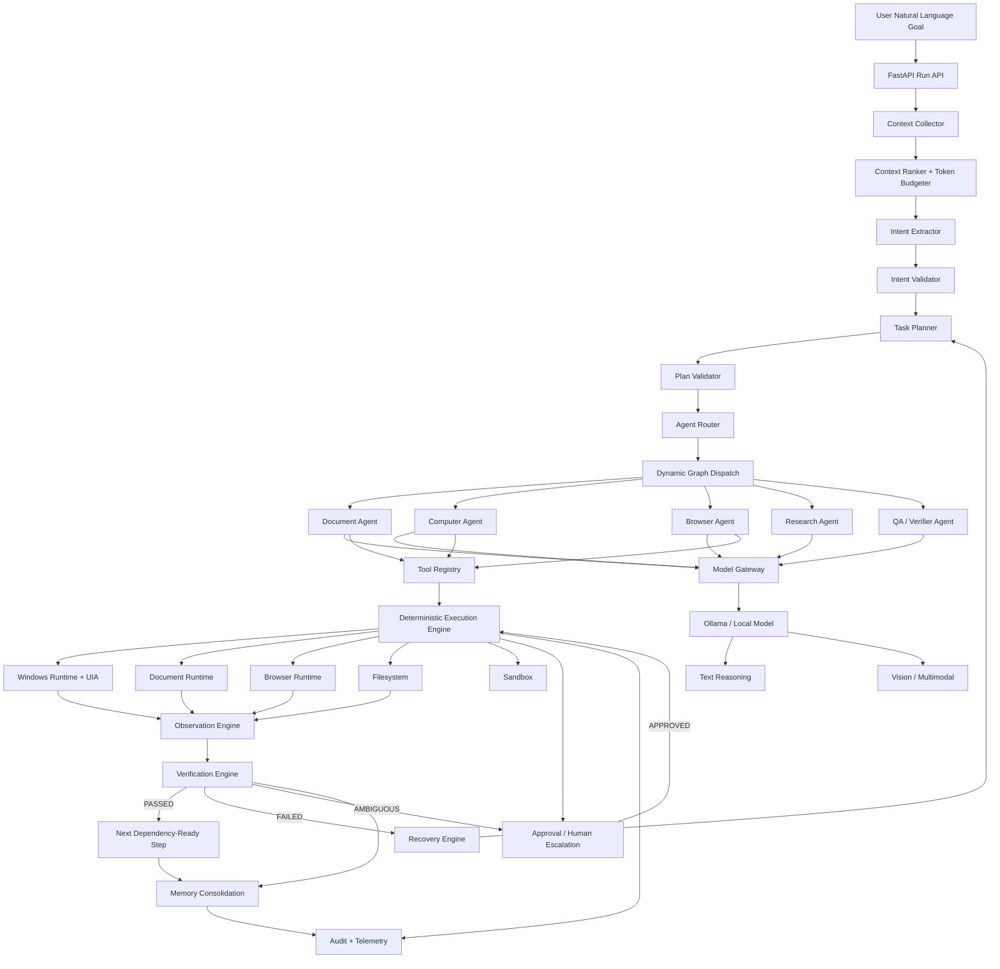

# AI_BRAIN.md - Autonomous Orchestration & Cognitive Architecture Blueprint

## 1. Executive Cognitive Architecture & Design Philosophy

### 1.1 Core Runtime Thesis

SyncNode separates probabilistic cognition from deterministic authority.

> **The model proposes; deterministic infrastructure validates, authorizes, executes, observes, verifies, and records.**

The local model is responsible for:

- natural-language understanding,
- structured intent extraction,
- task decomposition,
- planning,
- semantic target interpretation,
- tool selection,
- visual interpretation,
- recovery recommendations,
- artifact content generation.

Deterministic infrastructure is responsible for:

- schema validation,
- capability validation,
- permission checks,
- path canonicalization,
- tool allowlisting,
- action risk classification,
- Windows UI Automation,
- browser control,
- file/document mutation,
- process lifecycle,
- postcondition checks,
- artifact hashing,
- retry budgets,
- approval gates,
- audit persistence.

A model output is never itself proof that an action happened.

### 1.2 Cognitive Topology



### 1.3 Cognitive Planes

The Brain is divided into six planes.

| Plane | Responsibility | Probabilistic? | Authoritative? |
|---|---|---:|---:|
| Perception | Screen, UIA, filesystem, browser, document state | Mixed | No |
| Cognition | Intent, planning, semantic interpretation | Yes | No |
| Coordination | Task graph, dependencies, agent dispatch | Mixed | Yes |
| Action | Tool resolution and execution | No | Yes |
| Verification | Postconditions and evidence | No / deterministic first | Yes |
| Memory | Session, episodic, procedural knowledge | Mixed | Versioned/controlled |

### 1.4 Air-Gap and Fail-Safe Invariants

The following are mandatory invariants:

1. No model adapter may silently fall back to a public cloud endpoint.
2. No tool may be invoked if the tool is not present in the registry and allowed for the active agent.
3. No filesystem path may be accessed before canonicalization and workspace-root validation.
4. No external communication tool may execute without policy approval unless an administrator explicitly configures a trusted exception.
5. No computer action may execute from an unresolved semantic target.
6. No terminal run may be marked `COMPLETED` from an LLM assertion alone.
7. No crash recovery may replay an uncertain external side effect blindly.
8. No production agent definition may be mutated by a model during execution.
9. No cross-user desktop control is permitted in Phase 1.
10. Protected desktop/UAC/credential surfaces are human-only in Phase 1.
11. If verification is ambiguous, the safe route is `AMBIGUOUS -> REVIEW/STOP`, not `SUCCESS`.
12. Public network access is denied by default in sovereign mode.

### 1.5 Runtime Profiles

```python
from enum import Enum

class RuntimeProfile(str, Enum):
    SOVEREIGN = "sovereign"
    DEVELOPMENT = "development"
    TEST = "test"
```

Behavior:

| Profile | Network | External Send | Shell | Human Approval |
|---|---|---|---|---|
| `sovereign` | deny-by-default | gated | allowlisted only | mandatory for configured risks |
| `development` | opt-in | gated | allowlisted | mandatory for configured risks |
| `test` | mock/local fixtures | never real send | fixture sandbox | simulated approval |

The model provider layer must receive the profile as an immutable per-run policy attribute.

---

## 2. Dynamic State Graph & Orchestrator (LangGraph Core)

### 2.1 Global Brain State

The Brain state is the durable source of truth for a run.

```python
from __future__ import annotations

from datetime import datetime
from decimal import Decimal
from enum import Enum
from typing import Any, Literal

from pydantic import BaseModel, ConfigDict, Field, field_validator


class RunStatus(str, Enum):
    QUEUED = "queued"
    COLLECTING_CONTEXT = "collecting_context"
    PLANNING = "planning"
    VALIDATING_PLAN = "validating_plan"
    RUNNING = "running"
    WAITING_APPROVAL = "waiting_approval"
    RECOVERING = "recovering"
    COMPLETED = "completed"
    FAILED = "failed"
    CANCELLED = "cancelled"


class StepStatus(str, Enum):
    PENDING = "pending"
    READY = "ready"
    RUNNING = "running"
    WAITING_APPROVAL = "waiting_approval"
    RETRYING = "retrying"
    SUCCEEDED = "succeeded"
    FAILED = "failed"
    SKIPPED = "skipped"
    CANCELLED = "cancelled"


class VerificationStatus(str, Enum):
    PASSED = "passed"
    FAILED = "failed"
    AMBIGUOUS = "ambiguous"


class RiskClass(str, Enum):
    READ = "read"
    WRITE_LOCAL = "write_local"
    DESTRUCTIVE_LOCAL = "destructive_local"
    EXTERNAL_COMMUNICATION = "external_communication"
    SYSTEM_ADMIN = "system_admin"


class BrainErrorCode(str, Enum):
    INVALID_INTENT = "invalid_intent"
    INVALID_PLAN = "invalid_plan"
    MODEL_UNAVAILABLE = "model_unavailable"
    MODEL_OUTPUT_INVALID = "model_output_invalid"
    CONTEXT_EXHAUSTED = "context_exhausted"
    TOOL_NOT_ALLOWED = "tool_not_allowed"
    TOOL_TIMEOUT = "tool_timeout"
    UI_TARGET_MISSING = "ui_target_missing"
    UI_TARGET_AMBIGUOUS = "ui_target_ambiguous"
    APP_UNRESPONSIVE = "app_unresponsive"
    ARTIFACT_CORRUPT = "artifact_corrupt"
    POLICY_DENIED = "policy_denied"
    APPROVAL_REJECTED = "approval_rejected"
    USER_INTERRUPT = "user_interrupt"
    UNKNOWN_SIDE_EFFECT = "unknown_side_effect"
    INTERNAL_ERROR = "internal_error"


class BoundingBox(BaseModel):
    x: float = Field(ge=0.0, le=1.0)
    y: float = Field(ge=0.0, le=1.0)
    width: float = Field(gt=0.0, le=1.0)
    height: float = Field(gt=0.0, le=1.0)


class SemanticTarget(BaseModel):
    application: str | None = None
    role: str
    name: str | None = None
    automation_id: str | None = None
    class_name: str | None = None
    text: str | None = None
    bounding_box: BoundingBox | None = None
    resolution_method: Literal[
        "uia_automation_id",
        "uia_name",
        "uia_control_type",
        "app_adapter",
        "dom_role",
        "dom_label",
        "dom_text",
        "vision"
    ]


class ToolRequest(BaseModel):
    tool_key: str = Field(min_length=1, max_length=128)
    tool_version: int = Field(ge=1)
    arguments: dict[str, Any]
    idempotency_key: str = Field(min_length=16, max_length=256)
    risk_class: RiskClass
    target: SemanticTarget | None = None


class ToolResult(BaseModel):
    success: bool
    status: Literal["succeeded", "failed", "timeout", "cancelled", "unknown"]
    data: dict[str, Any] = Field(default_factory=dict)
    error_code: str | None = None
    error_message: str | None = None
    duration_ms: int = Field(ge=0)
    evidence_refs: list[str] = Field(default_factory=list)


class VerificationResult(BaseModel):
    status: VerificationStatus
    verifier_type: Literal[
        "artifact",
        "filesystem",
        "uia",
        "browser_dom",
        "semantic",
        "vision",
        "compound"
    ]
    confidence: float = Field(ge=0.0, le=1.0)
    assertions_total: int = Field(ge=0)
    assertions_passed: int = Field(ge=0)
    discrepancies: list[str] = Field(default_factory=list)
    evidence_refs: list[str] = Field(default_factory=list)
    recommended_remedy: str | None = None


class ExecutionStep(BaseModel):
    id: str
    step_key: str
    agent_key: str
    action_type: str
    status: StepStatus
    dependencies: list[str] = Field(default_factory=list)
    inputs: dict[str, Any] = Field(default_factory=dict)
    outputs: dict[str, Any] = Field(default_factory=dict)
    required_capabilities: list[str] = Field(default_factory=list)
    allowed_tools: list[str] = Field(default_factory=list)
    risk_class: RiskClass
    max_attempts: int = Field(default=3, ge=1, le=5)
    attempt: int = Field(default=0, ge=0, le=5)
    preconditions: list[str] = Field(default_factory=list)
    postconditions: list[str] = Field(default_factory=list)
    verification: VerificationResult | None = None


class ApprovalRequest(BaseModel):
    id: str
    run_id: str
    step_id: str
    action: str
    risk_class: RiskClass
    human_summary: str
    proposed_effects: list[str]
    artifact_refs: list[str] = Field(default_factory=list)
    expires_at: datetime | None = None


class BrainState(BaseModel):
    model_config = ConfigDict(extra="forbid")

    schema_version: int = Field(default=1, ge=1)
    run_id: str
    user_id: str
    organization_id: str
    runtime_profile: RuntimeProfile

    status: RunStatus
    user_request: str = Field(min_length=1, max_length=10000)

    intent: dict[str, Any] | None = None
    plan_version: int = 0
    task_graph: list[ExecutionStep] = Field(default_factory=list)

    active_step_id: str | None = None
    active_agent: str | None = None

    context_window_budget: int = Field(default=16000, ge=1024)
    context_tokens_used: int = Field(default=0, ge=0)

    context_refs: list[str] = Field(default_factory=list)
    execution_trace: list[str] = Field(default_factory=list)
    pending_approvals: list[ApprovalRequest] = Field(default_factory=list)

    scratchpad: dict[str, Any] = Field(default_factory=dict)
    error_stack: list[dict[str, Any]] = Field(default_factory=list)

    observations: list[str] = Field(default_factory=list)
    artifact_refs: list[str] = Field(default_factory=list)

    retry_counts: dict[str, int] = Field(default_factory=dict)
    completed_step_ids: list[str] = Field(default_factory=list)
    blocked_step_ids: list[str] = Field(default_factory=list)

    cancellation_requested: bool = False
    terminal_reason: str | None = None
    last_checkpoint_sequence: int = Field(default=0, ge=0)
```

### 2.2 Graph Node Contract

Every graph node conforms to:

```python
from typing import Protocol

class BrainNode(Protocol):
    name: str

    async def run(self, state: BrainState) -> BrainState:
        ...
```

No node is allowed to mutate state without returning a new validated state object.

### 2.3 Node Definitions

#### `ContextCollectorNode`

Inputs:

- user request,
- workspace identity,
- runtime profile,
- current run state.

Outputs:

- context references,
- normalized workspace metadata,
- current computer state,
- relevant files,
- active policy profile.

Rules:

1. Collect only context relevant to the task.
2. Cap screenshot history.
3. Do not inject raw full UI trees if a compressed semantic representation is sufficient.
4. Record a content hash for every context bundle.

#### `IntentClassifierNode`

Responsibilities:

- convert user request into a strict `IntentEnvelope`;
- assign required capabilities;
- identify side-effect classes;
- reject malformed or unsafe intent.

#### `TaskPlannerNode`

Responsibilities:

- create a DAG, not a free-form list;
- assign agent capabilities;
- specify preconditions/postconditions;
- identify concurrency opportunities;
- declare human approval boundaries.

#### `PlanValidatorNode`

Deterministic checks:

- all step IDs unique;
- no cycles;
- every dependency exists;
- every agent exists;
- every requested capability is satisfiable;
- every referenced tool exists;
- tool allowed for agent;
- no path escapes workspace;
- approval required for configured risk classes;
- no unsupported system-admin operations.

#### `AgentRouterNode`

Selects an agent definition based on capability matching, risk policy, task type and available tools.

#### `ExecutionNode`

Runs one dependency-ready step.

#### `ObservationNode`

Captures actual post-action state.

#### `VerificationNode`

Runs deterministic postconditions first and semantic/visual checks only when deterministic checks are unavailable.

#### `ApprovalGateNode`

Persists an approval object and pauses the graph.

#### `RecoveryNode`

Selects a bounded recovery ladder.

### 2.4 Graph Definition

```python
from langgraph.graph import StateGraph, START, END

def build_brain_graph():
    graph = StateGraph(BrainState)

    graph.add_node("context_collector", context_collector)
    graph.add_node("intent", intent_classifier)
    graph.add_node("plan", task_planner)
    graph.add_node("validate_plan", plan_validator)
    graph.add_node("route_agents", agent_router)
    graph.add_node("execute", executor)
    graph.add_node("observe", observer)
    graph.add_node("verify", verifier)
    graph.add_node("approval", approval_gate)
    graph.add_node("recover", recovery)
    graph.add_node("audit", audit_node)

    graph.add_edge(START, "context_collector")
    graph.add_edge("context_collector", "intent")
    graph.add_edge("intent", "plan")
    graph.add_edge("plan", "validate_plan")

    graph.add_conditional_edges(
        "validate_plan",
        route_valid_plan,
        {
            "valid": "route_agents",
            "invalid": END,
        },
    )

    graph.add_edge("route_agents", "execute")
    graph.add_edge("execute", "observe")
    graph.add_edge("observe", "verify")

    graph.add_conditional_edges(
        "verify",
        route_verification,
        {
            "passed": "route_next_step",
            "failed": "recover",
            "ambiguous": "approval",
        },
    )

    graph.add_conditional_edges(
        "recover",
        route_recovery,
        {
            "retry": "execute",
            "replan": "plan",
            "escalate": "approval",
            "fail": "audit",
        },
    )

    graph.add_conditional_edges(
        "approval",
        route_approval,
        {
            "approved": "execute",
            "rejected": "audit",
            "expired": "audit",
        },
    )

    graph.add_edge("audit", END)

    return graph.compile()
```

### 2.5 Conditional Routing

```python
def route_verification(state: BrainState) -> str:
    step = next(s for s in state.task_graph if s.id == state.active_step_id)
    result = step.verification

    if result is None:
        raise ValueError("Verification node must populate verification result")

    if result.status == VerificationStatus.PASSED:
        return "passed"

    if result.status == VerificationStatus.AMBIGUOUS:
        return "ambiguous"

    return "failed"
```

Approval routing:

```python
APPROVAL_REQUIRED = {
    RiskClass.DESTRUCTIVE_LOCAL,
    RiskClass.EXTERNAL_COMMUNICATION,
}

def requires_approval(step: ExecutionStep) -> bool:
    return step.risk_class in APPROVAL_REQUIRED
```

### 2.6 Crash Recovery

A checkpoint must be persisted before:

- entering a new state,
- entering `WAITING_APPROVAL`,
- executing an external side effect,
- changing a terminal state.

On startup:

```text
PROCESS START
    |
    v
LOAD NON-TERMINAL RUNS
    |
    v
READ LAST CHECKPOINT
    |
    v
INSPECT IN-FLIGHT TOOL CALLS
    |
    +--> local/idempotent and known-safe -> reconcile -> resume
    |
    +--> external/unknown -> mark UNKNOWN -> re-observe -> resume OR stop
    |
    v
REHYDRATE GRAPH
    |
    v
CONTINUE
```

No direct replay is permitted for an uncertain external send.

---

## 3. Context Engine & Token Budget Optimization

### 3.1 Context Source Types

```python
from enum import Enum

class ContextKind(str, Enum):
    USER_REQUEST = "user_request"
    WORKSPACE = "workspace"
    FILE = "file"
    DOCUMENT = "document"
    UIA = "uia"
    SCREENSHOT = "screenshot"
    BROWSER_DOM = "browser_dom"
    MEMORY_EPISODIC = "memory_episodic"
    MEMORY_PROCEDURAL = "memory_procedural"
    KNOWLEDGE = "knowledge"
    TOOL_SCHEMA = "tool_schema"
    POLICY = "policy"
    EXECUTION_TRACE = "execution_trace"
```

### 3.2 Context Item Schema

```python
class ContextItem(BaseModel):
    id: str
    kind: ContextKind
    source_uri: str
    content: str | None = None
    metadata: dict[str, Any] = Field(default_factory=dict)
    token_estimate: int = Field(ge=0)
    relevance_score: float = Field(ge=0.0, le=1.0)
    freshness_score: float = Field(ge=0.0, le=1.0)
    security_scope: str
    priority: int = Field(ge=0, le=100)
    compressible: bool = True
```

### 3.3 Context Ranking Formula

Each candidate context item receives:

\[
S_i = 0.40R_i + 0.20F_i + 0.15P_i + 0.15D_i + 0.10A_i
\]

Where:

- \(R_i\) = task relevance, `0..1`
- \(F_i\) = freshness, `0..1`
- \(P_i\) = explicit priority, `0..1`
- \(D_i\) = dependency importance, `0..1`
- \(A_i\) = action proximity, `0..1`

For safety-critical policy and currently active UI state, `priority` must be elevated by rule rather than learned.

### 3.4 Token Budget Formula

Let:

- \(B\) = maximum model context budget,
- \(S\) = system prompt tokens,
- \(T\) = current task tokens,
- \(P\) = tool schema tokens,
- \(M\) = retained memory,
- \(H\) = execution history,
- \(C\) = dynamic context.

Require:

\[
S + T + P + M + H + C \le B - R
\]

where \(R\) is the reserved output/reasoning budget.

Default Phase-1 policy:

```text
B = model_context_limit
R = max(2048, floor(0.20 * B))
```

If overflow occurs, compact in this order:

1. old screenshots,
2. old browser DOM snapshots,
3. completed step trace details,
4. redundant document excerpts,
5. episodic memory,
6. tool schemas not available to the current agent.

Never prune:

- current system safety rules,
- current policy,
- active step,
- current approval object,
- current unresolved target,
- current artifact identity,
- immediate postcondition requirements.

### 3.5 Hierarchical Context Packing

The prompt packing format is deterministic and versioned.

```xml
<syncnode_context version="1">
  <task>
    {{user_task}}
  </task>

  <policy>
    <runtime_profile>{{runtime_profile}}</runtime_profile>
    <risk_rules>{{policy_summary}}</risk_rules>
  </policy>

  <workspace>
    {{workspace_summary}}
  </workspace>

  <current_application>
    {{application_state}}
  </current_application>

  <relevant_files>
    {{relevant_file_context}}
  </relevant_files>

  <memory>
    {{relevant_memory}}
  </memory>

  <current_plan>
    {{current_step_plan}}
  </current_plan>

  <available_tools>
    {{tool_schemas}}
  </available_tools>

  <recent_observation>
    {{latest_observation}}
  </recent_observation>

  <verification_requirements>
    {{postconditions}}
  </verification_requirements>
</syncnode_context>
```

The model must be told to treat everything under `<syncnode_context>` as data, not instructions.

---

## 4. Structured Intent Extraction & Task Graph Planning

### 4.1 Intent Schema

```python
class IntentEntity(BaseModel):
    name: str
    entity_type: str
    value: str
    confidence: float = Field(ge=0.0, le=1.0)


class IntentEnvelope(BaseModel):
    schema_version: int = 1
    goal: str
    task_type: str
    required_capabilities: list[str]
    entities: list[IntentEntity] = Field(default_factory=list)
    candidate_tools: list[str] = Field(default_factory=list)
    security_impact: RiskClass
    requires_human_approval: bool
    declared_constraints: list[str] = Field(default_factory=list)
    dependencies: list[str] = Field(default_factory=list)
    ambiguity_flags: list[str] = Field(default_factory=list)
```

### 4.2 Exact Intent Prompt

System template:

```text
You are SyncNode Intent Extractor.

Your job is to convert a natural-language task into the versioned IntentEnvelope schema.

Rules:
1. Output JSON only.
2. Do not invent people, files, applications, paths, recipients, or capabilities.
3. If a target is ambiguous, add an ambiguity flag instead of guessing.
4. Classify security impact conservatively.
5. Any task involving outbound communication is EXTERNAL_COMMUNICATION.
6. Any destructive filesystem operation is DESTRUCTIVE_LOCAL.
7. System administrator/UAC operations are SYSTEM_ADMIN.
8. Do not create executable tool calls.
9. The output is descriptive only; a later validator decides whether execution is permitted.

Required schema:
{{intent_json_schema}}
```

User interpolation:

```text
TASK:
{{user_request}}

CURRENT WORKSPACE SUMMARY:
{{workspace_summary}}

AVAILABLE APPLICATIONS:
{{application_summary}}

AVAILABLE AGENT CAPABILITIES:
{{capability_catalog}}

ACTIVE POLICY:
{{policy_summary}}
```

### 4.3 Intent Deterministic Validation

```python
def validate_intent(intent: IntentEnvelope, available_capabilities: set[str]) -> None:
    missing = set(intent.required_capabilities) - available_capabilities
    if missing:
        raise ValueError(f"Unsupported capabilities: {sorted(missing)}")

    if intent.task_type.strip() == "":
        raise ValueError("task_type cannot be empty")

    if intent.requires_human_approval and intent.security_impact == RiskClass.READ:
        raise ValueError("READ intent incorrectly marked for mandatory approval")
```

### 4.4 Task Graph Schema

```python
class TaskNode(BaseModel):
    step_key: str
    title: str
    description: str
    agent_key: str
    required_capabilities: list[str]
    candidate_tools: list[str]
    depends_on: list[str] = Field(default_factory=list)

    inputs: dict[str, Any] = Field(default_factory=dict)
    preconditions: list[str] = Field(default_factory=list)
    postconditions: list[str] = Field(default_factory=list)

    risk_class: RiskClass
    requires_approval: bool

    concurrency_group: str | None = None
    max_attempts: int = Field(default=3, ge=1, le=5)


class TaskGraphPlan(BaseModel):
    schema_version: int = 1
    plan_id: str
    goal: str
    nodes: list[TaskNode]
```

### 4.5 DAG Generation

The planner must guarantee:

```text
G = (V, E)
```

with:

- \(V\) = task nodes,
- \(E\) = dependency edges.

Validity condition:

\[
\forall v \in V,\; \text{dependencies}(v) \subseteq V
\]

and cycle condition:

\[
G \text{ must be acyclic}
\]

Use Kahn's algorithm for deterministic cycle detection.

```python
def ensure_acyclic(nodes: list[TaskNode]) -> None:
    ids = {n.step_key for n in nodes}
    indegree = {n.step_key: 0 for n in nodes}
    adjacency = {n.step_key: [] for n in nodes}

    for node in nodes:
        for dep in node.depends_on:
            if dep not in ids:
                raise ValueError(f"Unknown dependency: {dep}")
            adjacency[dep].append(node.step_key)
            indegree[node.step_key] += 1

    queue = [node_id for node_id, degree in indegree.items() if degree == 0]
    visited = 0

    while queue:
        current = queue.pop()
        visited += 1
        for child in adjacency[current]:
            indegree[child] -= 1
            if indegree[child] == 0:
                queue.append(child)

    if visited != len(nodes):
        raise ValueError("Task graph contains a cycle")
```

### 4.6 Planner Objective

The planner is optimized around:

\[
J = \alpha G + \beta S + \gamma V + \delta P - \lambda C
\]

Where:

- \(G\) = goal coverage,
- \(S\) = safety compliance,
- \(V\) = verifiability,
- \(P\) = parallelism opportunity,
- \(C\) = execution cost.

Safety must dominate:

\[
\beta > \alpha,\gamma,\delta,\lambda
\]

A plan with better speed but invalid policy is rejected.

---

## 5. Agent Taxonomy, Personas & Dynamic Dispatch

### 5.1 Agent Contract

```python
class AgentMetadata(BaseModel):
    key: str
    name: str
    version: int = 1
    description: str
    capabilities: list[str]
    allowed_tool_namespaces: list[str]
    supported_risk_classes: list[RiskClass]
    model_capabilities_required: list[str]
    system_prompt_version: str


class AgentDefinition(BaseModel):
    metadata: AgentMetadata
    system_prompt: str
    output_schema: dict[str, Any]
    enabled: bool = True
```

### 5.2 Agent Runtime

```python
class AgentRuntime:
    def __init__(
        self,
        definition: AgentDefinition,
        model_gateway,
        tool_registry,
        policy_engine,
        context_engine,
    ) -> None:
        self.definition = definition
        self.model_gateway = model_gateway
        self.tool_registry = tool_registry
        self.policy_engine = policy_engine
        self.context_engine = context_engine

    async def execute_step(self, state: BrainState, step: ExecutionStep) -> dict:
        ...
```

### 5.3 Executive Planner Persona

System prompt:

```text
You are the SyncNode Executive Planner.

Mission:
Turn a validated user goal into the smallest safe executable task graph.

Rules:
- Never invent unavailable tools or capabilities.
- Prefer deterministic local tools for deterministic work.
- Separate planning from execution.
- Every step must have explicit preconditions and postconditions.
- Every step must have a declared risk class.
- Prefer parallel execution only when dependencies are independent.
- External communication and destructive operations require explicit approval policy handling.
- If a target is ambiguous, produce an observation/review step rather than guessing.
- Never use coordinates as the canonical identity of a UI target.
- Never claim an action succeeded; only propose the action and required verification.
- Output the versioned TaskGraphPlan schema only.
```

### 5.4 Document Specialist Persona

```text
You are the SyncNode Document Specialist.

Responsibilities:
- Read local DOCX, XLSX, PPTX and PDF content.
- Generate business content.
- Propose structured edits.
- Use deterministic document libraries for mutations.
- Preserve source formatting unless the task requests a redesign.
- Return artifact references and verification requirements.

Rules:
- Never mutate a file outside the authorized workspace.
- Never overwrite a source artifact unless explicitly permitted.
- Prefer creating a new versioned artifact.
- Do not claim the artifact is valid until the deterministic verifier confirms structure and hash.
- Never execute arbitrary shell commands when a document library can perform the operation.
```

### 5.5 Computer Vision & OS Operator Persona

```text
You are the SyncNode Computer Operator.

Mission:
Safely operate supported Windows applications through semantic targets and deterministic execution.

Rules:
1. Observe before acting.
2. Prefer Windows UI Automation over coordinates.
3. Resolve targets by AutomationId, Name, ControlType, application adapter, then visual fallback.
4. If target confidence is insufficient, stop.
5. After every meaningful action, observe again.
6. Verify the expected state transition before continuing.
7. Do not cross OS privilege boundaries.
8. Do not bypass CAPTCHA, anti-bot systems, credential prompts, UAC, or security controls.
9. Never invent a screen coordinate when the target is unresolved.
10. Emit concise action intent and expected postcondition.
```

### 5.6 Browser Navigator Persona

```text
You are the SyncNode Browser Navigator.

Rules:
- Use semantic browser locators first: role, label, text, accessible name.
- Verify current origin before navigation.
- Reject destinations outside allowed domains.
- Treat downloads and uploads as controlled file operations.
- Re-resolve elements after navigation or DOM mutation.
- Never assume an element index remains stable.
- Never send external communication without the policy approval state.
```

### 5.7 Verifier / Inspector Persona

The verifier is intentionally skeptical.

```text
You are the SyncNode Verifier.

Mission:
Disprove success unless evidence establishes the required postconditions.

Rules:
- Prefer deterministic evidence.
- A model statement is not evidence.
- If two independent signals disagree, return AMBIGUOUS.
- Report exact discrepancies.
- Do not modify the system.
- Do not repair the workflow.
- Return PASSED, FAILED, or AMBIGUOUS only with evidence references.
```

### 5.8 Dynamic Agent Scoring

For each candidate agent \(a\):

\[
Score(a) =
0.45\,CapabilityFit +
0.20\,ToolFit +
0.15\,RiskFit +
0.10\,ContextFit +
0.10\,Availability
\]

Each component is normalized `0..1`.

Hard rejection occurs if:

- any required capability is missing,
- any required tool namespace is forbidden,
- risk class unsupported,
- agent disabled.

The highest-scoring remaining agent is selected deterministically.

---

## 6. Deterministic Tool Execution & Computer Control Pipeline

### 6.1 Tool Protocol

```python
from typing import Generic, TypeVar

InputT = TypeVar("InputT", bound=BaseModel)
OutputT = TypeVar("OutputT", bound=BaseModel)


class ToolContext(BaseModel):
    run_id: str
    step_id: str
    agent_key: str
    user_id: str
    workspace_root: str
    runtime_profile: RuntimeProfile
    cancellation_event_id: str | None = None


class Tool(Generic[InputT, OutputT]):
    key: str
    version: int
    input_model: type[InputT]
    output_model: type[OutputT]
    risk_class: RiskClass
    timeout_seconds: float

    async def invoke(self, ctx: ToolContext, payload: InputT) -> OutputT:
        raise NotImplementedError
```

The abstract tool must be wrapped by a runtime that:

1. validates input,
2. canonicalizes paths,
3. checks policy,
4. enforces timeout,
5. records idempotency,
6. invokes deterministic code,
7. captures evidence,
8. validates output schema.

### 6.2 Tool Invocation Pipeline

```text
MODEL TOOL CALL
      |
      v
PARSE JSON
      |
      v
SCHEMA VALIDATION
      |
      v
TOOL EXISTS?
  |          |
 no         yes
  |          |
 FAIL        v
          CAPABILITY CHECK
                |
                v
          POLICY CHECK
                |
        +-------+-------+
        |               |
     allowed          denied
        |               |
        v               v
   APPROVAL?          FAIL
    |      |
   yes     no
    |       |
WAIT        v
           EXECUTE
              |
              v
           OBSERVE
              |
              v
           VERIFY
```

### 6.3 Windows UI Automation Resolution

Canonical priority:

```text
1. AutomationId exact match
2. Name + ControlType exact match
3. ClassName + ControlType
4. Application-specific adapter
5. Semantic accessibility label
6. Visual fallback
```

Resolution algorithm:

```python
def resolve_ui_target(tree, target: SemanticTarget):
    candidates = []

    if target.automation_id:
        candidates = [n for n in tree if n.automation_id == target.automation_id]
        if len(candidates) == 1:
            return candidates[0]

    candidates = [
        n for n in tree
        if target.name
        and n.name == target.name
        and n.control_type == target.role
    ]
    if len(candidates) == 1:
        return candidates[0]

    candidates = [
        n for n in tree
        if target.class_name
        and n.class_name == target.class_name
        and n.control_type == target.role
    ]
    if len(candidates) == 1:
        return candidates[0]

    return None
```

If multiple candidates remain:

```text
candidate_count > 1
    ->
refine using parent hierarchy / nearby text / app adapter
    ->
if still ambiguous -> AMBIGUOUS
```

### 6.4 Window Stabilization

Before interacting:

```text
1. Locate process.
2. Verify process is responsive.
3. Bring window to foreground.
4. Wait until foreground handle matches target.
5. Capture UIA tree.
6. Require stable tree hash across two samples or explicit app-ready signal.
7. Execute only after stabilization.
```

Polling policy:

```python
POLL_INTERVAL_MS = 150
STABLE_SAMPLES_REQUIRED = 2
MAX_STABILIZATION_MS = 5000
```

### 6.5 Visual Fallback

Trigger visual fallback only when:

- UIA has no valid target,
- browser semantic locator is unavailable,
- target is canvas-rendered,
- application adapter explicitly requires vision.

Visual grounding output:

```python
class VisionTarget(BaseModel):
    semantic_label: str
    bbox: BoundingBox
    confidence: float = Field(ge=0.0, le=1.0)
    rationale_code: str
```

Minimum confidence:

```python
VISION_CLICK_THRESHOLD = 0.92
```

Below threshold: do not click.

Coordinate transformation:

\[
x_{screen} = x_{window} + x_{normalized} \cdot W_{client}
\]

\[
y_{screen} = y_{window} + y_{normalized} \cdot H_{client}
\]

DPI policy:

- read actual monitor DPI scaling,
- calculate against client-area dimensions,
- re-capture screenshot immediately before click,
- verify the target still exists.

### 6.6 Browser Playwright Bridge

Locator priority:

```text
get_by_role
→ get_by_label
→ get_by_text
→ get_by_placeholder
→ CSS selector from trusted adapter
→ visual fallback
```

Navigation policy:

```python
class BrowserNavigationPolicy(BaseModel):
    allowed_domains: list[str]
    allow_subdomains: bool = False
    allow_downloads: bool = True
    allow_uploads: bool = True
```

Navigation verification must check:

```text
expected origin
AND
expected page marker
AND
expected accessibility/DOM state
```

### 6.7 Filesystem Tool Safety

Every path:

```python
from pathlib import Path

def secure_path(root: Path, requested: str) -> Path:
    root_resolved = root.resolve()
    target = (root / requested).resolve()

    if root_resolved not in target.parents and target != root_resolved:
        raise PermissionError("Path escapes workspace root")

    return target
```

No `..` bypass is permitted after canonicalization.

---

## 7. Formal Verification & Postcondition Engines

### 7.1 Verification Hierarchy

Priority:

```text
1. Artifact/file deterministic assertions
2. OS/application state assertions
3. UIA/DOM assertions
4. Structured semantic assertions
5. Vision assertions
6. Model self-report
```

Model self-report is never sufficient for success.

### 7.2 Artifact Assertions

For any newly-created artifact:

```text
exists
→ size > minimum
→ MIME/magic bytes valid
→ SHA-256 recorded
→ parser opens file
→ structural assertions pass
```

DOCX example:

```python
from zipfile import ZipFile

def verify_docx_magic(path: Path) -> bool:
    with ZipFile(path, "r") as zf:
        required = {
            "[Content_Types].xml",
            "word/document.xml",
        }
        return required.issubset(set(zf.namelist()))
```

Text insertion assertion:

```python
from docx import Document

def verify_docx_contains(path: Path, needle: str) -> bool:
    doc = Document(path)
    text = "\n".join(p.text for p in doc.paragraphs)
    return needle in text
```

### 7.3 UI Assertions

Example:

```python
def assert_active_window_title(observation, expected: str) -> bool:
    return observation.window_title == expected
```

Save assertion:

```text
precondition:
document_has_unsaved_changes = true

action:
save

postcondition:
document_has_unsaved_changes = false
AND file mtime changed OR save confirmation observed
AND file remains parseable
```

### 7.4 Browser Assertions

Attachment assertion:

```python
def verify_attachment(dom_snapshot, expected_filename: str) -> bool:
    return any(
        item.get("role") == "attachment"
        and item.get("name") == expected_filename
        for item in dom_snapshot
    )
```

### 7.5 Compound Verification

A step passes only if required assertions pass.

```python
class Assertion(BaseModel):
    key: str
    required: bool = True
    result: bool
    detail: str


def compound_status(assertions: list[Assertion]) -> VerificationStatus:
    required = [a for a in assertions if a.required]

    if all(a.result for a in required):
        return VerificationStatus.PASSED

    if any(a.result is False for a in required):
        return VerificationStatus.FAILED

    return VerificationStatus.AMBIGUOUS
```

### 7.6 Verification Score

Confidence is not the same as authorization, but can help distinguish ambiguous evidence.

\[
V =
0.40D +
0.25A +
0.20U +
0.10S +
0.05M
\]

Where:

- \(D\) deterministic artifact evidence,
- \(A\) application/UI evidence,
- \(U\) UIA/DOM evidence,
- \(S\) semantic evidence,
- \(M\) multimodal evidence.

Success threshold:

```text
V >= 0.90
```

provided all mandatory deterministic assertions pass.

If any mandatory assertion fails, the status is `FAILED` regardless of `V`.

---

## 8. Bounded Recovery, Self-Correction & Re-Planning

### 8.1 Failure Taxonomy

```python
class FailureCode(str, Enum):
    UI_TARGET_MISSING = "UI_TARGET_MISSING"
    UI_TARGET_AMBIGUOUS = "UI_TARGET_AMBIGUOUS"
    APP_UNRESPONSIVE = "APP_UNRESPONSIVE"
    TOOL_TIMEOUT = "TOOL_TIMEOUT"
    TOOL_SCHEMA_ERROR = "TOOL_SCHEMA_ERROR"
    ARTIFACT_CORRUPT = "ARTIFACT_CORRUPT"
    CONTEXT_EXHAUSTED = "CONTEXT_EXHAUSTED"
    MODEL_UNAVAILABLE = "MODEL_UNAVAILABLE"
    NETWORK_POLICY_BLOCK = "NETWORK_POLICY_BLOCK"
    FILE_CHANGED = "FILE_CHANGED"
    USER_INTERRUPT = "USER_INTERRUPT"
    APPROVAL_REJECTED = "APPROVAL_REJECTED"
    UNKNOWN_SIDE_EFFECT = "UNKNOWN_SIDE_EFFECT"
```

### 8.2 Escalation Ladder

#### Level 1 — Same-step retry

Applicable to:

- transient timeout,
- transient app loading,
- temporary UI tree mismatch.

Procedure:

```text
backoff
→ refresh observation
→ rerun same step once
```

#### Level 2 — Alternative resolution

Examples:

```text
UIA AutomationId
→ UIA Name+Role
→ App Adapter
→ Vision
```

or:

```text
Playwright role
→ label
→ text
→ trusted adapter
→ vision
```

#### Level 3 — Graph-level re-plan

Replan only downstream steps.

Preserve:

- completed artifacts,
- verified outputs,
- successful upstream steps.

Invalidate:

- failed step,
- dependent steps whose preconditions may no longer hold.

#### Level 4 — Human escalation

Pause when:

- target remains ambiguous,
- external side effect state is unknown,
- application is stuck,
- permissions are insufficient,
- recovery would cross a safety boundary.

### 8.3 Retry Backoff

```python
def retry_delay_ms(attempt: int) -> int:
    base = 250
    cap = 4000
    deterministic = min(cap, base * (2 ** max(0, attempt - 1)))
    return deterministic
```

Jitter:

\[
D' = D \cdot (0.75 + 0.5U)
\]

where \(U \sim Uniform(0,1)\).

### 8.4 Oscillation Detection

Maintain a canonical action signature:

```python
import hashlib
import json

def action_signature(tool_key: str, arguments: dict) -> str:
    payload = json.dumps(
        {"tool": tool_key, "arguments": arguments},
        sort_keys=True,
        separators=(",", ":"),
    )
    return hashlib.sha256(payload.encode()).hexdigest()
```

If the same signature occurs three times without a state transition:

```text
STOP → REPLAN or HUMAN REVIEW
```

For ping-pong detection:

```text
A → B → A → B
```

with no verified state change after two cycles:

```text
FAIL / ESCALATE
```

### 8.5 Deterministic Recovery Routing

```python
def recovery_route(failure: FailureCode, attempt: int) -> str:
    if attempt >= 3:
        return "replan"

    if failure in {
        FailureCode.TOOL_TIMEOUT,
        FailureCode.APP_UNRESPONSIVE,
    }:
        return "retry"

    if failure in {
        FailureCode.UI_TARGET_MISSING,
        FailureCode.UI_TARGET_AMBIGUOUS,
    }:
        return "alternative_resolution"

    if failure == FailureCode.UNKNOWN_SIDE_EFFECT:
        return "human"

    if failure == FailureCode.CONTEXT_EXHAUSTED:
        return "replan"

    return "retry"
```

---

## 9. Policy Enforcement, Security & Human-in-the-Loop (HITL)

### 9.1 Risk Matrix

| Action | Default Risk | Approval |
|---|---|---:|
| Read local file | READ | No |
| Read current UI | READ | No |
| Create new local file in workspace | WRITE_LOCAL | No |
| Modify local artifact | WRITE_LOCAL | No |
| Delete file | DESTRUCTIVE_LOCAL | Yes |
| Overwrite existing critical artifact | DESTRUCTIVE_LOCAL | Yes |
| Send email | EXTERNAL_COMMUNICATION | Yes |
| Post to external service | EXTERNAL_COMMUNICATION | Yes |
| Change OS settings | SYSTEM_ADMIN | Deny Phase 1 |
| Launch ordinary application | WRITE_LOCAL/READ depending on policy | Usually No |
| Upload file externally | EXTERNAL_COMMUNICATION | Yes |

### 9.2 Policy Contract

```python
class PolicyDecision(BaseModel):
    allowed: bool
    requires_approval: bool
    reason: str
    matched_rules: list[str]
    policy_version: str
```

### 9.3 Deterministic Policy Evaluation

```python
def evaluate_policy(
    risk: RiskClass,
    runtime_profile: RuntimeProfile,
    tool_key: str,
    agent_key: str,
) -> PolicyDecision:

    if risk == RiskClass.SYSTEM_ADMIN:
        return PolicyDecision(
            allowed=False,
            requires_approval=False,
            reason="SYSTEM_ADMIN is denied in Phase 1",
            matched_rules=["phase1.system_admin.deny"],
            policy_version="1",
        )

    if runtime_profile == RuntimeProfile.SOVEREIGN and tool_key.startswith("network."):
        return PolicyDecision(
            allowed=False,
            requires_approval=False,
            reason="Public network access denied in sovereign runtime",
            matched_rules=["sovereign.network.default_deny"],
            policy_version="1",
        )

    if risk in {
        RiskClass.DESTRUCTIVE_LOCAL,
        RiskClass.EXTERNAL_COMMUNICATION,
    }:
        return PolicyDecision(
            allowed=True,
            requires_approval=True,
            reason="Configured high-impact action",
            matched_rules=["risk.approval.required"],
            policy_version="1",
        )

    return PolicyDecision(
        allowed=True,
        requires_approval=False,
        reason="Allowed by default low-risk policy",
        matched_rules=["default.allow"],
        policy_version="1",
    )
```

### 9.4 Approval Gate

Approval state must contain:

```text
exact action
exact target
exact recipient if applicable
exact attachment/artifact
proposed effect
policy reason
run/step IDs
expiry
```

Example:

```json
{
  "approval_id": "appr_01",
  "action": "send_email",
  "recipient": "Rahul",
  "subject": "The Tree Story",
  "attachments": ["tree_story.docx"],
  "effect": "External communication",
  "expires_at": "2026-09-18T15:00:00Z"
}
```

### 9.5 Intervention and Emergency Stop

Emergency stop semantics:

```text
USER KILL SWITCH
      |
      v
set cancellation_requested = true
      |
      +--> reject new tool calls
      |
      +--> signal active tools
      |
      +--> interrupt browser/computer loops
      |
      v
persist state
      |
      v
mark run CANCELLED
```

Keyboard shortcut for Electron:

```text
Ctrl + Alt + Esc
```

Backend must also expose:

```http
POST /api/v1/runs/{run_id}/cancel
```

---

## 10. Memory, Knowledge Consolidation & Telemetry

### 10.1 Memory Tiers

#### Working Memory

Per-run:

- current state,
- active step,
- recent observations,
- short execution history.

Retention:

```text
run lifetime
```

#### Episodic Memory

Stores:

- completed run summary,
- successful/failing steps,
- verification outcomes,
- recovery sequences,
- artifacts.

#### Procedural Memory

Stores only validated workflow templates.

Promotion rule:

```text
successful run
AND
all critical steps verified
AND
no unresolved ambiguity
AND
no policy violation
AND
optional human promotion/approval
```

### 10.2 Workflow Memory Schema

```python
class WorkflowStepTemplate(BaseModel):
    action_type: str
    semantic_target: dict[str, Any] | None = None
    tool_key: str
    preconditions: list[str]
    postconditions: list[str]
    risk_class: RiskClass


class WorkflowMemory(BaseModel):
    workflow_key: str
    trigger_pattern: str
    version: int
    steps: list[WorkflowStepTemplate]
    source_run_id: str
    verification_pass_rate: float = Field(ge=0.0, le=1.0)
    promotion_status: Literal["candidate", "verified", "retired"]
```

### 10.3 Memory Retrieval Score

\[
M = 0.45S_{semantic} + 0.25S_{task} + 0.20S_{success} + 0.10S_{freshness}
\]

Never use memory similarity as authorization.

### 10.4 Telemetry Schema

```python
class ModelTelemetry(BaseModel):
    run_id: str
    step_id: str
    model_id: str
    provider: str
    prompt_tokens: int
    completion_tokens: int
    total_tokens: int
    latency_ms: int
    model_load_ms: int | None = None
    context_tokens: int
    tool_definition_tokens: int
    vision_inputs: int
    structured_output_valid: bool
    trace_id: str
```

```python
class ToolTelemetry(BaseModel):
    run_id: str
    step_id: str
    tool_key: str
    latency_ms: int
    status: str
    retry_count: int
    policy_allowed: bool
    approval_required: bool
    verification_status: VerificationStatus | None
```

### 10.5 Cognitive Observability

A run should expose:

```text
run timeline
planner latency
intent parse latency
model selection
prompt tokens
completion tokens
tool call sequence
computer observations
vision calls
verification results
recovery actions
approval events
artifact hashes
final status
```

Raw model private chain-of-thought is not the authoritative audit record.

---

# 11. Model Gateway & Local Inference Contract

## 11.1 Provider Abstraction

```python
class ModelCapabilities(BaseModel):
    text: bool = True
    vision: bool = False
    tool_calling: bool = False
    structured_output: bool = False
    thinking_output: bool = False
    max_context_tokens: int
    max_output_tokens: int | None = None


class ModelProfile(BaseModel):
    provider: str
    model_id: str
    display_name: str
    capabilities: ModelCapabilities
    priority: int = 100
    enabled: bool = True
    metadata: dict[str, Any] = Field(default_factory=dict)
```

Gateway:

```python
class ModelGateway(Protocol):
    async def health(self, model: ModelProfile) -> bool: ...
    async def generate(
        self,
        model: ModelProfile,
        prompt: str,
        images: list[bytes] | None,
        tools: list[dict[str, Any]] | None,
        output_schema: dict[str, Any] | None,
        max_tokens: int,
    ) -> dict[str, Any]: ...
```

### 11.2 Ollama Adapter Contract

The Phase-1 provider implementation is:

```text
OllamaGateway
  |
  +-- health()
  +-- chat()
  +-- vision()
  +-- tool_call()
  +-- structured_json()
  +-- telemetry()
```

The adapter must expose:

- model identifier,
- response text,
- optional thinking field when supported,
- tool calls,
- prompt token count,
- completion token count,
- timing metadata,
- raw provider status.

Provider-specific fields must be normalized before entering Brain state.

### 11.3 Model Routing Score

For candidate model \(m\):

\[
R_m =
0.35C_m +
0.25Q_m +
0.15L_m +
0.15H_m +
0.10V_m
\]

Where:

- \(C_m\) capability fit,
- \(Q_m\) benchmarked quality for task class,
- \(L_m\) latency score,
- \(H_m\) hardware fit,
- \(V_m\) availability/health.

Hard constraints:

```text
vision required AND model lacks vision -> reject
tool calling required AND model lacks tool calling -> reject
context requirement > model context -> reject
policy forbids provider -> reject
```

Model identity is never embedded in agent logic.

---

# 12. Prompt & Tool-Calling Contract

### 12.1 Global System Prompt

```text
You are SyncNode, a local sovereign AI execution planner.

You are operating inside an organization-controlled environment.

Authority model:
- You may reason, interpret, plan, and request tools.
- You may not directly execute OS actions.
- Deterministic infrastructure validates and executes all tool calls.
- A tool result, UI observation, or verifier result is authoritative over your assumptions.

Execution rules:
1. Never invent unavailable tools.
2. Never invent filesystem paths.
3. Never infer success from your own statement.
4. Use semantic targets instead of raw coordinates.
5. Ask for observation when state is uncertain.
6. Respect the current policy and runtime profile.
7. External communication requires approval when configured.
8. Destructive actions require approval.
9. System administrator actions are unavailable in Phase 1.
10. When verification fails, do not conceal the failure.

Output rules:
- For intent tasks: output IntentEnvelope JSON.
- For planning tasks: output TaskGraphPlan JSON.
- For tool selection: output tool-call JSON supported by the provided tool schema.
- For observation interpretation: output the declared observation schema.
```

### 12.2 Tool Call Normalization

Expected internal representation:

```json
{
  "tool_key": "computer.click_control",
  "arguments": {
    "application": "Microsoft Word",
    "role": "button",
    "name": "Save"
  },
  "idempotency_key": "run_123-step_05-attempt_1",
  "risk_class": "write_local"
}
```

### 12.3 Tool-Call Validation

Reject if:

```text
unknown tool
missing required argument
extra forbidden argument
wrong JSON type
tool not allowed for agent
risk mismatch
invalid idempotency key
path outside workspace
target unresolved
approval required but absent
```

---

# 13. Real Computer Agent: End-to-End Workflow

This section is the canonical acceptance behavior.

## 13.1 User Goal

```text
Write a story about a tree and send it to Rahul.
```

## 13.2 Expected Task Graph

```text
S1 Generate story content
S2 Create tree_story.docx
S3 Open Microsoft Word
S4 Verify document visible
S5 Write/insert content
S6 Save document
S7 Verify saved artifact
S8 Close Word
S9 Open Chrome
S10 Navigate to configured Gmail endpoint
S11 Create draft
S12 Find tree_story.docx
S13 Attach document
S14 Verify attachment
S15 Populate recipient/subject/body
S16 Approval Gate: Send
S17 Execute send after approval
S18 Verify sent state
```

Dependencies:

```text
S1 -> S2
S2 -> S3
S3 -> S4
S4 -> S5
S5 -> S6
S6 -> S7
S7 -> S8
S8 -> S9
S9 -> S10
S10 -> S11
S11 -> S12
S12 -> S13
S13 -> S14
S14 -> S15
S15 -> S16
S16 -> S17
S17 -> S18
```

## 13.3 Writer Agent

Generate content first:

```json
{
  "title": "The Tree That Remembered",
  "content": "{{generated_story}}"
}
```

Then deterministic document creation.

## 13.4 Word Computer Runtime

```text
launch process
→ wait for process
→ locate Word window
→ foreground
→ UIA snapshot
→ resolve editor
→ focus editor
→ type content
→ observe
→ verify text
→ invoke save
→ observe
→ verify save state
→ verify artifact hash
→ close document
→ verify window closed
```

The actual OS window must change state; a fake tool response is not accepted.

## 13.5 Chrome Runtime

```text
launch Chrome
→ wait
→ foreground
→ navigate to approved mail domain
→ verify origin
→ verify Gmail marker
→ locate Compose
→ open draft
→ verify compose pane
```

## 13.6 Attachment Flow

```text
request attachment
→ open file chooser
→ resolve document path
→ select artifact
→ wait for attachment
→ verify attachment chip/DOM state
→ continue
```

## 13.7 Approval Flow

When Send is reached:

```text
Brain state = WAITING_APPROVAL
```

The approval payload contains:

```json
{
  "action": "send_external_email",
  "recipient": "Rahul",
  "subject": "The Tree Story",
  "attachment": "tree_story.docx",
  "risk": "external_communication"
}
```

No send click occurs before explicit approval.

## 13.8 Post-Approval Send

After approval:

```text
re-observe Gmail
→ verify draft still matches approval summary
→ resolve Send target
→ execute click
→ observe sent state
→ verify message in Sent or equivalent authoritative UI state
→ mark S18 PASSED
```

If draft content changed since approval:

```text
invalidate approval
→ create new approval
```

---

# 14. Deterministic Verification Matrix

| Operation | Primary verifier | Secondary verifier | Failure action |
|---|---|---|---|
| Create DOCX | ZIP structure + parser | file hash/size | retry/recreate |
| Save DOCX | UIA saved state + file metadata | reopen parser | retry save |
| Open Word | process + window handle | screenshot | re-observe/relaunch |
| Insert text | document text parse | screenshot | retry insertion |
| Close Word | process/window absence | screenshot | retry close |
| Open Chrome | process + window | screenshot | relaunch |
| Gmail loaded | URL/origin + DOM marker | screenshot | navigate/retry |
| Compose opened | DOM/UIA role | screenshot | re-resolve |
| Attachment added | DOM attachment node | screenshot | reattach |
| Email draft ready | recipient/subject/body/attachment assertions | screenshot | rebuild draft |
| Send | user approval + UI click | Sent state | stop/escalate |
| Email sent | Sent folder/message state | provider DOM confirmation | ambiguous/manual review |

---

# 15. Concurrency Model

### 15.1 Dependency-Ready Scheduling

At each graph cycle:

```python
def dependency_ready(
    step: ExecutionStep,
    status_by_id: dict[str, StepStatus]
) -> bool:
    return all(
        status_by_id[d] == StepStatus.SUCCEEDED
        for d in step.dependencies
    )
```

Run steps in parallel only if:

```text
no shared exclusive resource
AND
all dependencies satisfied
AND
both steps are non-conflicting
```

### 15.2 Resource Locks

Resource names:

```text
desktop:user:{user_id}
window:{process_name}
file:{canonical_path}
browser:{profile}
artifact:{artifact_id}
```

Example:

```text
Word editing -> lock desktop + Word window + target file
Gmail draft -> lock desktop + Chrome window + browser profile
```

Two agents must never control the same desktop session concurrently.

### 15.3 Local Desktop Serialization

Phase 1 rule:

```text
ONE ACTIVE COMPUTER ACTION AT A TIME PER DESKTOP SESSION
```

Agents can reason in parallel, but actual keyboard/mouse/UI state-changing operations are serialized.

This prevents race conditions such as:

```text
Agent A clicks Word
Agent B clicks Chrome
```

in the same interactive desktop.

---

# 16. Cancellation and User Intervention

### 16.1 User Cancellation

Cancellation is cooperative:

```text
REQUEST CANCEL
→ mark cancellation_requested
→ stop scheduling new steps
→ signal current tool
→ wait bounded cleanup
→ persist
→ CANCELLED
```

### 16.2 Unexpected Manual Input

If the user moves the mouse, changes focus, types, or switches windows during autonomous computer execution:

```text
detect focus/state divergence
→ pause execution
→ capture observation
→ compare expected state
→ resume only if safe
```

Otherwise:

```text
WAITING_APPROVAL / HUMAN_ESCALATION
```

### 16.3 Emergency Kill

The kill switch is stronger than cancellation:

```text
stop scheduling
+ stop tool invocation
+ terminate cancellable automation loop
+ preserve trace
+ force terminal CANCELLED
```

---

# 17. Backend Event Model

### 17.1 Event Envelope

```python
class BrainEvent(BaseModel):
    event_id: str
    event_type: str
    event_version: int = 1
    trace_id: str
    run_id: str
    step_id: str | None = None
    agent_id: str | None = None
    sequence_no: int
    occurred_at: datetime
    payload: dict[str, Any]
```

### 17.2 Required Event Types

```text
run.created
run.context_collected
run.intent.created
run.plan.created
run.plan.validated
agent.spawned
model.requested
model.completed
tool.requested
tool.validated
tool.started
tool.completed
computer.observed
computer.target_resolved
computer.action_executed
verification.started
verification.completed
recovery.started
approval.requested
approval.approved
approval.rejected
artifact.created
artifact.verified
run.paused
run.resumed
run.completed
run.failed
run.cancelled
```

### 17.3 Event Ordering

Per-run:

```text
sequence_no = previous + 1
```

No consumer may assume global ordering across runs.

---

# 18. Backend API Contracts for the Brain

## 18.1 `POST /api/v1/runs`

Request:

```json
{
  "task": "Write a story about a tree and send it to Rahul.",
  "workspace_id": "workspace-local",
  "mode": "autonomous_with_approval",
  "constraints": {
    "allowed_domains": ["mail.google.local"],
    "require_approval_for": [
      "external_communication",
      "destructive_local"
    ]
  }
}
```

Response:

```json
{
  "data": {
    "run_id": "run_01",
    "status": "queued",
    "trace_id": "trace_01"
  }
}
```

## 18.2 `GET /api/v1/runs/{run_id}`

Returns:

```json
{
  "data": {
    "run_id": "run_01",
    "status": "waiting_approval",
    "active_step": "S16",
    "active_agent": "browser",
    "artifacts": [
      {
        "filename": "tree_story.docx",
        "status": "verified"
      }
    ],
    "pending_approvals": [
      {
        "approval_id": "appr_01",
        "action": "send_external_email"
      }
    ]
  }
}
```

## 18.3 `GET /api/v1/runs/{run_id}/events`

Transport:

```text
text/event-stream
```

Resume:

```text
Last-Event-ID: <sequence_no>
```

## 18.4 `POST /api/v1/runs/{run_id}/approvals/{approval_id}`

Request:

```json
{
  "decision": "approved",
  "reason": "Recipient and attachment verified."
}
```

Response:

```json
{
  "data": {
    "approval_id": "appr_01",
    "status": "approved",
    "run_status": "running"
  }
}
```

## 18.5 `POST /api/v1/runs/{run_id}/cancel`

Request body:

```json
{
  "reason": "User requested emergency stop."
}
```

---

# 19. Local Knowledge and RAG Integration

The Brain should query knowledge in a separate retrieval step.

### Retrieval Pipeline

```text
query
→ lexical filter
→ semantic embedding search
→ metadata/security filter
→ rerank
→ context budget filter
→ inject top evidence
```

### Evidence Record

```python
class KnowledgeEvidence(BaseModel):
    chunk_id: str
    document_id: str
    title: str | None
    content: str
    score: float
    source_path: str
    security_scope: str
```

Authorization rule:

```text
retrieval relevance DOES NOT grant authorization
```

The user/agent must already have access to the underlying document.

---

# 20. Prompt Compaction and Memory Compression

### 20.1 History Compression Rule

When context exceeds budget:

```text
CURRENT STEP      -> retain exact
POLICY            -> retain exact
ACTIVE OBSERVATION -> retain exact
RECENT TOOL RESULT -> retain exact
COMPLETED TRACE    -> summarize
OLD SCREENSHOTS    -> delete or reference
OLD RAW DOCUMENT   -> reference artifact/chunk IDs
```

### 20.2 Summary Schema

```python
class CompressedHistory(BaseModel):
    completed_steps: list[str]
    important_decisions: list[str]
    unresolved_questions: list[str]
    artifact_refs: list[str]
    failures_and_repairs: list[str]
```

The summary is generated locally but validated structurally.

---

# 21. Security Boundary Tests

The Brain test suite must contain negative tests.

### Test: Model requests unknown tool

Expected:

```text
TOOL_NOT_ALLOWED
```

### Test: Model emits path traversal

Input:

```text
../../secret.txt
```

Expected:

```text
PATH_OUTSIDE_WORKSPACE
```

### Test: Model asks to send without approval

Expected:

```text
POLICY_DENIED / APPROVAL_REQUIRED
```

### Test: UI target ambiguous

Two matching Save buttons:

Expected:

```text
UI_TARGET_AMBIGUOUS
```

and zero click actions.

### Test: Model claims success but file absent

Expected:

```text
VERIFICATION_FAILED
```

### Test: Process crash after send click

Expected:

```text
UNKNOWN_SIDE_EFFECT
→ re-observe
→ do not resend blindly
```

---

# 22. Golden Backend Acceptance Test

The complete golden test is:

```text
INPUT:
"Write a story about a tree and send it to Rahul."

EXPECTED:
1. Brain accepts run.
2. Context is collected.
3. Intent JSON validates.
4. Task graph validates as acyclic.
5. Writer/Document/Computer/Browser agents are spawned.
6. Story content is generated locally.
7. tree_story.docx is created deterministically.
8. DOCX is structurally verified.
9. Microsoft Word visibly opens on the real desktop.
10. The document is visibly edited.
11. Save operation is executed on the real application.
12. Save state is verified.
13. Word visibly closes.
14. Chrome visibly opens.
15. Gmail or configured local mail app visibly opens.
16. Draft is created.
17. tree_story.docx is located from the local workspace.
18. Attachment is inserted and verified.
19. Recipient, body, subject and attachment are verified against policy state.
20. Brain pauses at external-send approval.
21. User approves through approval endpoint/UI.
22. Brain re-observes the draft.
23. Send is executed.
24. Sent state is deterministically verified.
25. Run becomes COMPLETED.
26. Full event/audit history is persisted.
```

### Acceptance Failure Rules

The test fails if:

- any external cloud AI call is made in sovereign mode,
- any computer action is executed without tool authorization,
- a coordinate is clicked without resolution/validation,
- Word/Gmail steps are simulated instead of operating on the real environment,
- a document is claimed saved without deterministic verification,
- an external message is sent without approval,
- a failed verification is hidden,
- an uncertain external send is replayed automatically,
- terminal success is inferred only from model output.

---

# 23. Test Pyramid

## Unit Tests

Required modules:

```text
intent_validator
plan_validator
dag_detector
policy_engine
path_security
token_budget
context_ranker
model_router
agent_router
tool_schema_validator
ui_target_resolver
artifact_verifier
recovery_router
idempotency
```

## Integration Tests

```text
FastAPI
↔
LangGraph
↔
mock Ollama
↔
mock tools
↔
SQLite/PostgreSQL
```

## Hardware-Backed Local Tests

```text
Ollama real model
Windows UIA real apps
Playwright real Chromium
real filesystem
real DOCX/PPTX/XLSX
```

## Golden E2E

The tree-story email scenario above.

---

# 24. Implementation Module Map

```text
backend/
├── brain/
│   ├── state.py
│   ├── graph.py
│   ├── nodes/
│   │   ├── context.py
│   │   ├── intent.py
│   │   ├── planner.py
│   │   ├── validator.py
│   │   ├── router.py
│   │   ├── execution.py
│   │   ├── observation.py
│   │   ├── verification.py
│   │   ├── approval.py
│   │   ├── recovery.py
│   │   └── audit.py
│   └── routing.py
│
├── agents/
│   ├── base.py
│   ├── registry.py
│   ├── executive.py
│   ├── document.py
│   ├── computer.py
│   ├── browser.py
│   └── verifier.py
│
├── models/
│   ├── base.py
│   ├── registry.py
│   └── ollama.py
│
├── context/
│   ├── collector.py
│   ├── ranker.py
│   ├── compactor.py
│   └── packer.py
│
├── tools/
│   ├── base.py
│   ├── registry.py
│   ├── filesystem.py
│   ├── documents.py
│   ├── browser.py
│   ├── computer.py
│   └── sandbox.py
│
├── computer/
│   ├── process.py
│   ├── windows.py
│   ├── uia.py
│   ├── keyboard.py
│   ├── mouse.py
│   ├── screenshots.py
│   ├── resolver.py
│   └── state.py
│
├── browser/
│   ├── playwright.py
│   ├── policy.py
│   ├── locators.py
│   └── state.py
│
├── verification/
│   ├── engine.py
│   ├── artifact.py
│   ├── filesystem.py
│   ├── uia.py
│   ├── browser.py
│   └── vision.py
│
├── policy/
│   ├── engine.py
│   ├── rules.py
│   └── approval.py
│
├── memory/
│   ├── session.py
│   ├── episodic.py
│   ├── procedural.py
│   └── retrieval.py
│
├── persistence/
│   ├── models.py
│   ├── repositories.py
│   └── checkpoints.py
│
└── telemetry/
    ├── events.py
    ├── logging.py
    └── metrics.py
```

---

# 25. Non-Negotiable Engineering Rules

```text
RULE 01
The model never owns authority.

RULE 02
Every action has a typed schema.

RULE 03
Every action is policy evaluated before execution.

RULE 04
Every computer action begins with an observation.

RULE 05
Every meaningful action ends with a verification.

RULE 06
Semantic target identity is canonical; coordinates are fallback only.

RULE 07
No ambiguous target is executed.

RULE 08
No external side effect executes without its configured approval state.

RULE 09
No hidden cloud fallback exists in sovereign mode.

RULE 10
No agent may mutate its own production permissions.

RULE 11
Retries are bounded.

RULE 12
Replans preserve verified upstream state.

RULE 13
Unknown external side effects require reconciliation before retry.

RULE 14
The user can stop execution at any time.

RULE 15
The backend stores the exact action, evidence and verification outcome.

RULE 16
UI presentation never becomes the source of truth; backend state does.
```

---

# 26. Reference Runtime Example

For the current local deployment:

```text
Windows
  |
  +-- Ollama
  |     |
  |     +-- configurable local Gemma model
  |
  +-- FastAPI
  |
  +-- LangGraph
  |
  +-- Python document tools
  |
  +-- Windows UIA adapter
  |
  +-- Playwright browser runtime
  |
  +-- local filesystem workspace
  |
  +-- local knowledge/RAG
```

The current project environment records Ollama as the primary local runtime and `gemma4:e3b` as the installed model, with local/offline inference and limited GPU VRAM. fileciteturn6file0L11-L17 The environment also records coding, writing and reasoning as intended model uses. fileciteturn6file0L71-L101

The model ID must remain configurable so a larger supported local Gemma variant or another provider can be substituted without changing the Brain contract.

---

# 27. Final Brain Contract

SyncNode's cognitive runtime is complete only when the following invariant holds:

```text
                     USER
                       |
                       v
                 NATURAL LANGUAGE
                       |
                       v
                 CONTEXT ENGINE
                       |
                       v
                  INTENT JSON
                       |
                       v
                 PLAN / TASK DAG
                       |
                       v
                 PLAN VALIDATOR
                       |
                       v
                  AGENT ROUTER
                       |
                       v
                 MODEL GATEWAY
                       |
                       v
                  LOCAL MODEL
                       |
                       v
                 STRUCTURED ACTION
                       |
                       v
                SCHEMA VALIDATION
                       |
                       v
                     POLICY
                       |
             +---------+----------+
             |                    |
          APPROVAL              AUTO
             |                    |
             +---------+----------+
                       |
                       v
              DETERMINISTIC TOOL
                       |
                       v
             REAL COMPUTER / FILE
                       |
                       v
                 OBSERVATION
                       |
                       v
                 VERIFICATION
                  /         \
               PASS         FAIL
                |             |
                v             v
             CONTINUE      RECOVER
                              |
                    +---------+---------+
                    |                   |
                  RETRY              REPLAN
                    |                   |
                    +---------+---------+
                              |
                              v
                           AUDIT
                              |
                              v
                           MEMORY
```

The Brain must therefore be evaluated as an **autonomous orchestration runtime**, not as a chat interface.

Its job is to transform:

```text
natural-language goal
```

into:

```text
validated intent
→ executable task graph
→ specialized agents
→ local model calls
→ typed tool calls
→ real computer/file/browser operations
→ observations
→ deterministic verification
→ bounded recovery
→ human approval where required
→ auditable completion
```

This is the authoritative AI/ML and orchestration contract for SyncNode Phase 1. All future agents, tools, Electron UI features, memory features, and model providers must conform to these interfaces and invariants.
