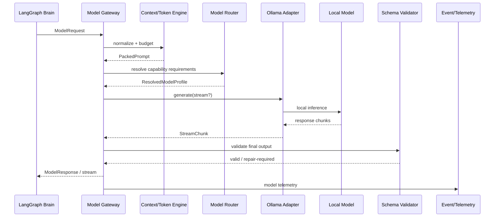

# MODEL_GATEWAY.md - Subsystem Technical Specification

## 1. Executive Subsystem Boundary & Design Philosophy

### 1.1 Scope

The SyncNode Model Gateway is the only subsystem permitted to convert a normalized Brain/Agent inference request into a concrete local model-runtime request.

The gateway sits between:

```text
UPSTREAM
LangGraph Brain
    |
    v
Agent Runtime
    |
    v
ModelGateway
    |
    v
DOWNSTREAM
Local Provider Adapter
    |
    v
Ollama / local inference runtime
    |
    v
Local model weights
```

The gateway owns:

- provider abstraction;
- model profile resolution;
- local-provider capability discovery;
- model selection inside the local-only trust boundary;
- request normalization;
- prompt packing;
- token-budget enforcement;
- structured-output enforcement;
- multimodal payload preparation;
- tool-schema normalization;
- asynchronous streaming;
- cooperative cancellation;
- timeout/deadline enforcement;
- retry and schema-repair policy;
- provider health;
- model warmup/residency policy;
- model telemetry;
- context hashing;
- air-gap enforcement.

The gateway does **not** own:

- user authentication;
- authorization policy for business actions;
- LangGraph task decomposition;
- agent persona logic;
- filesystem mutation;
- Windows UI Automation;
- browser automation;
- document mutation;
- final task verification;
- long-term memory persistence.

Those systems call the gateway through its stable domain contract.

### 1.2 Core Invariants

#### Invariant MG-01 — No cloud inference

Every inference request must resolve to a provider whose endpoint is classified as `LOCAL_LOOPBACK` or `LOCAL_UNIX_SOCKET` / equivalent approved on-host transport.

The gateway must reject:

```text
https://api.openai.com/*
https://generativelanguage.googleapis.com/*
https://api.anthropic.com/*
https://*.amazonaws.com/*
https://*.azure.com/*
```

and any other endpoint not explicitly registered as local.

No automatic cloud fallback exists.

#### Invariant MG-02 — Provider isolation

Brain code must not construct provider-specific HTTP payloads.

Only provider adapters know:

- endpoint paths;
- native message formats;
- streaming protocol;
- model-specific options;
- provider error codes.

#### Invariant MG-03 — Structured outputs are validated

Any request carrying `response_schema` must produce a Pydantic-valid object or terminate with `STRUCTURED_OUTPUT_INVALID`.

Text repair is bounded. A repair loop may not exceed two repairs after the initial generation.

#### Invariant MG-04 — Token budgets are enforced before invocation

The gateway must estimate/measure input token count before sending the request.

If:

```text
input_tokens + reserved_output_tokens + safety_headroom > model_context_limit
```

the request is compacted or rejected before inference.

#### Invariant MG-05 — Streaming is non-blocking

The gateway exposes async iterators. No model call may block the FastAPI event loop.

#### Invariant MG-06 — Cancellation propagates

A cancelled SyncNode run must propagate cancellation from Brain -> gateway -> provider transport.

#### Invariant MG-07 — Model output is not authority

Tool calls, plans, or action JSON returned by the model are data. The gateway validates syntax/schema only. Policy and execution authorization happen downstream.

#### Invariant MG-08 — Provider errors become typed domain errors

Raw provider exceptions must never escape to the Brain.

#### Invariant MG-09 — Telemetry is durable-ready

Every completed model call must produce normalized usage/latency telemetry suitable for `agent_runs`.

#### Invariant MG-10 — Configuration is immutable per call

The resolved model profile, provider endpoint, runtime profile, token budget and safety settings are frozen into a `ResolvedModelRequest` before the network request starts.

### 1.3 Runtime Boundary

```text
┌───────────────────────────────────────────────────────────────────────┐
│                         SYNCNODE LOCAL ZONE                           │
│                                                                       │
│  LangGraph Brain                                                      │
│        │                                                              │
│        ▼                                                              │
│  Agent Runtime                                                        │
│        │                                                              │
│        ▼                                                              │
│  ┌─────────────────────────────────────────────────────────────────┐  │
│  │                        MODEL GATEWAY                            │  │
│  │                                                                 │  │
│  │ Request Validator                                               │  │
│  │ Capability Router                                               │  │
│  │ Context/Token Manager                                           │  │
│  │ Structured Output Engine                                        │  │
│  │ Multimodal Packager                                              │  │
│  │ Cancellation/Timeout Manager                                     │  │
│  │ Telemetry                                                        │  │
│  └───────────────────────────────┬─────────────────────────────────┘  │
│                                  │                                     │
│                            LOCAL PROVIDER                              │
│                                  │                                     │
│                           Ollama Adapter                               │
│                                  │                                     │
│                       127.0.0.1 / localhost                            │
│                                  │                                     │
│                             Gemma/Qwen                                 │
│                                                                       │
└───────────────────────────────────────────────────────────────────────┘
```

### 1.4 Request Lifecycle



### 1.5 Provider State Machine

```text
DISCOVERED
    |
    v
HEALTHY
    |
    +------> DEGRADED
    |           |
    |           +----> HEALTHY
    |           |
    |           +----> UNAVAILABLE
    |
    +------> UNAVAILABLE
                  |
                  +----> PROBING
                              |
                              +----> HEALTHY
                              |
                              +----> UNAVAILABLE
```

Rules:

- `DEGRADED` means endpoint responds but recent requests exceed latency/error thresholds.
- `UNAVAILABLE` means connection failure, model missing, unsupported request, or local runtime failure.
- A provider cannot transition to `HEALTHY` solely because TCP connectivity exists; a local model availability probe must pass.

---

## 2. Provider Abstraction & Interface Contracts

### 2.1 Enumerations

```python
from __future__ import annotations

from abc import ABC, abstractmethod
from dataclasses import dataclass
from datetime import datetime
from enum import Enum
from typing import Any, AsyncIterator, Protocol, Sequence

from pydantic import BaseModel, ConfigDict, Field, model_validator


class ProviderLocality(str, Enum):
    LOCAL_LOOPBACK = "local_loopback"
    LOCAL_SOCKET = "local_socket"
    REMOTE_INTERNAL = "remote_internal"
    PUBLIC = "public"


class ProviderHealth(str, Enum):
    UNKNOWN = "unknown"
    PROBING = "probing"
    HEALTHY = "healthy"
    DEGRADED = "degraded"
    UNAVAILABLE = "unavailable"


class FinishReason(str, Enum):
    STOP = "stop"
    LENGTH = "length"
    TOOL_CALL = "tool_call"
    CONTENT_FILTER = "content_filter"
    ERROR = "error"
    CANCELLED = "cancelled"
    UNKNOWN = "unknown"


class StreamEventType(str, Enum):
    STARTED = "started"
    THINKING_DELTA = "thinking_delta"
    CONTENT_DELTA = "content_delta"
    TOOL_CALL_DELTA = "tool_call_delta"
    USAGE = "usage"
    COMPLETED = "completed"
    ERROR = "error"
    CANCELLED = "cancelled"


class GatewayErrorCode(str, Enum):
    PROVIDER_UNAVAILABLE = "PROVIDER_UNAVAILABLE"
    PROVIDER_NOT_LOCAL = "PROVIDER_NOT_LOCAL"
    MODEL_NOT_FOUND = "MODEL_NOT_FOUND"
    MODEL_CAPABILITY_MISMATCH = "MODEL_CAPABILITY_MISMATCH"
    MODEL_CONTEXT_TOO_SMALL = "MODEL_CONTEXT_TOO_SMALL"
    MODEL_BUSY = "MODEL_BUSY"
    VRAM_EXHAUSTED = "VRAM_EXHAUSTED"
    REQUEST_TIMEOUT = "REQUEST_TIMEOUT"
    TTFT_TIMEOUT = "TTFT_TIMEOUT"
    STREAM_TIMEOUT = "STREAM_TIMEOUT"
    CANCELLED = "CANCELLED"
    CONTEXT_OVERFLOW = "CONTEXT_OVERFLOW"
    STRUCTURED_OUTPUT_INVALID = "STRUCTURED_OUTPUT_INVALID"
    STRUCTURED_OUTPUT_REPAIR_EXHAUSTED = "STRUCTURED_OUTPUT_REPAIR_EXHAUSTED"
    UNSUPPORTED_VISION = "UNSUPPORTED_VISION"
    UNSUPPORTED_TOOLS = "UNSUPPORTED_TOOLS"
    AIR_GAP_VIOLATION = "AIR_GAP_VIOLATION"
    INVALID_REQUEST = "INVALID_REQUEST"
    TRANSPORT_ERROR = "TRANSPORT_ERROR"
    PROVIDER_PROTOCOL_ERROR = "PROVIDER_PROTOCOL_ERROR"
    INTERNAL_ERROR = "INTERNAL_ERROR"
```

### 2.2 Message Content Schema

A model message may contain text plus images. File content must be referenced by controlled local source IDs before encoding.

```python
class ImageInput(BaseModel):
    model_config = ConfigDict(extra="forbid")

    image_id: str = Field(min_length=1, max_length=128)
    media_type: str = Field(pattern=r"^image/(png|jpeg|webp)$")
    width: int = Field(gt=0)
    height: int = Field(gt=0)
    encoded_base64: str = Field(min_length=16)
    sha256: str = Field(min_length=64, max_length=64)

    @model_validator(mode="after")
    def validate_payload(self) -> "ImageInput":
        if not self.encoded_base64.strip():
            raise ValueError("encoded_base64 cannot be empty")
        return self


class ChatMessage(BaseModel):
    model_config = ConfigDict(extra="forbid")

    role: str = Field(pattern=r"^(system|user|assistant|tool)$")
    content: str = ""
    images: list[ImageInput] = Field(default_factory=list)
    tool_call_id: str | None = None
    name: str | None = None
```

### 2.3 Sampling Parameters

```python
class SamplingParameters(BaseModel):
    model_config = ConfigDict(extra="forbid")

    temperature: float = Field(default=0.2, ge=0.0, le=2.0)
    top_p: float = Field(default=0.9, gt=0.0, le=1.0)
    top_k: int | None = Field(default=None, ge=1, le=200)
    seed: int | None = None
    repeat_penalty: float | None = Field(default=None, ge=0.0, le=2.0)
```

SyncNode policy defaults:

```python
PLANNER_SAMPLING = SamplingParameters(
    temperature=0.1,
    top_p=0.9,
)

WRITER_SAMPLING = SamplingParameters(
    temperature=0.4,
    top_p=0.92,
)

STRUCTURED_SAMPLING = SamplingParameters(
    temperature=0.0,
    top_p=1.0,
)
```

### 2.4 Tool Definition

```python
class ToolFunction(BaseModel):
    model_config = ConfigDict(extra="forbid")

    name: str = Field(pattern=r"^[a-zA-Z0-9_.:-]{1,128}$")
    description: str = Field(min_length=1, max_length=4000)
    parameters: dict[str, Any]


class ToolDefinition(BaseModel):
    model_config = ConfigDict(extra="forbid")

    type: str = Field(default="function", pattern=r"^function$")
    function: ToolFunction
```

Normalized payload:

```json
{
  "type": "function",
  "function": {
    "name": "computer.click_control",
    "description": "Click a semantically resolved UI control.",
    "parameters": {
      "type": "object",
      "properties": {
        "application": {"type": "string"},
        "role": {"type": "string"},
        "name": {"type": "string"}
      },
      "required": ["application", "role", "name"],
      "additionalProperties": false
    }
  }
}
```

### 2.5 Response Schema

```python
class JsonSchemaTarget(BaseModel):
    model_config = ConfigDict(extra="forbid")

    name: str = Field(min_length=1, max_length=128)
    schema: dict[str, Any]
```

### 2.6 Model Requirements

```python
class ModelRequirements(BaseModel):
    model_config = ConfigDict(extra="forbid")

    capabilities: set[str] = Field(default_factory=set)
    vision_required: bool = False
    tool_calling_required: bool = False
    structured_output_required: bool = False
    thinking_required: bool = False

    minimum_context_tokens: int = Field(default=4096, ge=256)
    maximum_latency_ms: int | None = Field(default=None, ge=1)

    preferred_model_keys: list[str] = Field(default_factory=list)
    excluded_model_keys: list[str] = Field(default_factory=list)
```

### 2.7 Model Request

```python
class ModelRequest(BaseModel):
    model_config = ConfigDict(extra="forbid")

    request_id: str
    trace_id: str
    run_id: str
    step_id: str
    agent_key: str

    runtime_profile: str
    messages: list[ChatMessage] = Field(min_length=1)

    requirements: ModelRequirements
    sampling: SamplingParameters = Field(default_factory=SamplingParameters)

    max_output_tokens: int | None = Field(default=None, ge=1, le=32768)
    reserved_output_tokens: int = Field(default=2048, ge=256, le=32768)

    tools: list[ToolDefinition] = Field(default_factory=list)
    response_schema: JsonSchemaTarget | None = None

    stream: bool = True
    think: bool | str = False
    keep_alive_seconds: int | None = Field(default=300, ge=0, le=86400)

    deadline_ms: int = Field(default=120_000, ge=1000, le=600_000)
    ttft_timeout_ms: int = Field(default=5_000, ge=1000, le=30_000)
    stream_idle_timeout_ms: int = Field(default=2_000, ge=250, le=30_000)

    context_hash: str
    metadata: dict[str, Any] = Field(default_factory=dict)

    @model_validator(mode="after")
    def validate_request(self) -> "ModelRequest":
        if self.response_schema is not None and self.max_output_tokens is not None:
            if self.max_output_tokens < self.reserved_output_tokens:
                raise ValueError(
                    "max_output_tokens must be >= reserved_output_tokens"
                )

        if self.requirements.structured_output_required and self.response_schema is None:
            raise ValueError(
                "structured_output_required requires response_schema"
            )

        if self.requirements.vision_required:
            has_image = any(m.images for m in self.messages)
            if not has_image:
                raise ValueError("vision_required but no image input supplied")

        return self
```

### 2.8 Usage Metrics

```python
class UsageMetrics(BaseModel):
    prompt_tokens: int = Field(default=0, ge=0)
    completion_tokens: int = Field(default=0, ge=0)
    total_tokens: int = Field(default=0, ge=0)

    prompt_eval_duration_ms: int | None = Field(default=None, ge=0)
    generation_duration_ms: int | None = Field(default=None, ge=0)
    model_load_ms: int | None = Field(default=None, ge=0)
```

### 2.9 Model Response

```python
class ModelResponse(BaseModel):
    model_config = ConfigDict(extra="forbid")

    request_id: str
    provider: str
    model_id: str

    raw_text: str
    thinking_text: str | None = None

    tool_calls: list[dict[str, Any]] = Field(default_factory=list)

    structured_output: dict[str, Any] | None = None
    finish_reason: FinishReason

    usage: UsageMetrics
    latency_ms: int
    ttft_ms: int | None = None

    context_hash: str
    structured_output_valid: bool

    provider_request_id: str | None = None
    warnings: list[str] = Field(default_factory=list)
```

### 2.10 Streaming Chunk

```python
class StreamChunk(BaseModel):
    model_config = ConfigDict(extra="forbid")

    request_id: str
    trace_id: str
    sequence_no: int = Field(ge=0)

    event_type: StreamEventType

    content_delta: str = ""
    thinking_delta: str = ""

    tool_call_delta: dict[str, Any] | None = None
    usage: UsageMetrics | None = None

    done: bool = False
    finish_reason: FinishReason | None = None

    created_at: datetime
```

### 2.11 Error Envelope

```python
class GatewayError(BaseModel):
    code: GatewayErrorCode
    message: str
    retryable: bool
    provider: str | None = None
    model_id: str | None = None
    retry_after_ms: int | None = None
    trace_id: str
    details: dict[str, Any] = Field(default_factory=dict)
```

### 2.12 Typed Interfaces

```python
class ProviderClient(Protocol):
    provider_key: str

    async def health(self) -> ProviderHealth:
        ...

    async def list_models(self) -> list["RuntimeModel"]:
        ...

    async def inspect_model(self, model_id: str) -> "RuntimeModel":
        ...

    async def chat(
        self,
        request: "ProviderRequest",
    ) -> "ProviderResponse":
        ...

    async def stream_chat(
        self,
        request: "ProviderRequest",
    ) -> AsyncIterator["ProviderStreamEvent"]:
        ...

    async def cancel(self, request_id: str) -> None:
        ...
```

```python
class BaseModelProvider(ABC):
    provider_key: str
    locality: ProviderLocality

    @abstractmethod
    async def discover(self) -> list["RuntimeModel"]:
        ...

    @abstractmethod
    async def generate(self, request: ModelRequest) -> ModelResponse:
        ...

    @abstractmethod
    async def stream(self, request: ModelRequest) -> AsyncIterator[StreamChunk]:
        ...

    @abstractmethod
    async def close(self) -> None:
        ...
```

```python
class ModelGateway(Protocol):
    async def generate(self, request: ModelRequest) -> ModelResponse:
        ...

    async def stream(
        self,
        request: ModelRequest,
    ) -> AsyncIterator[StreamChunk]:
        ...

    async def health(self) -> ProviderHealth:
        ...

    async def resolve_model(
        self,
        requirements: ModelRequirements,
    ) -> "ResolvedModelProfile":
        ...
```

---

## 3. Local Engine Adapters (Ollama Driver)

### 3.1 Ollama Boundary

Phase 1 uses the local Ollama HTTP API.

Default endpoint:

```text
http://127.0.0.1:11434
```

The endpoint must be configurable only through a validated local-provider configuration.

Current Ollama's chat API accepts a `model`, `messages`, optional `tools`, `format` (`json` or a JSON schema), generation `options`, `stream`, `think`, and `keep_alive`; responses expose message content/tool calls plus timing and token-count fields. citeturn409724view0

Current Ollama streaming uses newline-delimited JSON for streaming endpoints; streaming can be disabled with `"stream": false`. Ollama documents non-streaming responses as simpler for short/structured outputs. citeturn896270view0

### 3.2 Provider Configuration

```python
from pydantic import AnyHttpUrl, field_validator

class LocalProviderConfig(BaseModel):
    model_config = ConfigDict(extra="forbid")

    provider_key: str = "ollama"
    base_url: str = "http://127.0.0.1:11434"
    locality: ProviderLocality = ProviderLocality.LOCAL_LOOPBACK

    connect_timeout_ms: int = Field(default=1000, ge=100, le=10000)
    read_timeout_ms: int = Field(default=120000, ge=1000, le=600000)
    max_connections: int = Field(default=16, ge=1, le=64)
    max_keepalive_connections: int = Field(default=8, ge=1, le=64)

    @field_validator("base_url")
    @classmethod
    def validate_locality(cls, value: str) -> str:
        from urllib.parse import urlparse

        parsed = urlparse(value)

        if parsed.scheme not in {"http", "https"}:
            raise ValueError("Only HTTP/HTTPS local provider URLs are allowed")

        hostname = parsed.hostname or ""

        allowed = {
            "127.0.0.1",
            "localhost",
            "::1",
        }

        if hostname not in allowed:
            raise ValueError(
                "Ollama Phase-1 provider must resolve to an approved loopback host"
            )

        if parsed.port not in {None, 11434}:
            raise ValueError("Unexpected Ollama port")

        return value
```

### 3.3 HTTP Client

```python
import httpx


class OllamaHttpClient:
    def __init__(self, config: LocalProviderConfig) -> None:
        timeout = httpx.Timeout(
            connect=config.connect_timeout_ms / 1000,
            read=config.read_timeout_ms / 1000,
            write=30.0,
            pool=30.0,
        )

        limits = httpx.Limits(
            max_connections=config.max_connections,
            max_keepalive_connections=config.max_keepalive_connections,
        )

        self._client = httpx.AsyncClient(
            base_url=config.base_url,
            timeout=timeout,
            limits=limits,
            headers={
                "Accept": "application/json",
                "Content-Type": "application/json",
            },
        )

    async def close(self) -> None:
        await self._client.aclose()
```

### 3.4 Ollama Request Normalization

```python
class ProviderRequest(BaseModel):
    model: str
    messages: list[dict[str, Any]]
    tools: list[dict[str, Any]] = Field(default_factory=list)
    format: str | dict[str, Any] | None = None
    options: dict[str, Any] = Field(default_factory=dict)
    stream: bool = True
    think: bool | str = False
    keep_alive: int | str | None = "5m"
```

Normalization:

```python
def to_ollama_request(req: ModelRequest, model_id: str) -> ProviderRequest:
    messages: list[dict[str, Any]] = []

    for msg in req.messages:
        item: dict[str, Any] = {
            "role": msg.role,
            "content": msg.content,
        }

        if msg.images:
            item["images"] = [
                image.encoded_base64
                for image in msg.images
            ]

        if msg.tool_call_id:
            item["tool_call_id"] = msg.tool_call_id

        if msg.name:
            item["name"] = msg.name

        messages.append(item)

    fmt: str | dict[str, Any] | None = None
    if req.response_schema is not None:
        fmt = req.response_schema.schema
    elif req.requirements.structured_output_required:
        fmt = "json"

    options = {
        "temperature": req.sampling.temperature,
        "top_p": req.sampling.top_p,
    }

    if req.sampling.top_k is not None:
        options["top_k"] = req.sampling.top_k
    if req.sampling.seed is not None:
        options["seed"] = req.sampling.seed

    if req.max_output_tokens is not None:
        options["num_predict"] = req.max_output_tokens

    keep_alive: int | str | None
    if req.keep_alive_seconds is None:
        keep_alive = None
    elif req.keep_alive_seconds == 0:
        keep_alive = 0
    else:
        keep_alive = f"{req.keep_alive_seconds}s"

    return ProviderRequest(
        model=model_id,
        messages=messages,
        tools=[
            tool.model_dump(mode="json")
            for tool in req.tools
        ],
        format=fmt,
        options=options,
        stream=req.stream,
        think=req.think,
        keep_alive=keep_alive,
    )
```

### 3.5 Streaming Driver

Ollama's streaming response is NDJSON. Each non-empty line is parsed independently.

```python
import json
from collections.abc import AsyncIterator


async def parse_ollama_stream(
    response: httpx.Response,
) -> AsyncIterator[dict[str, Any]]:
    async for line in response.aiter_lines():
        if not line:
            continue

        try:
            yield json.loads(line)
        except json.JSONDecodeError as exc:
            raise GatewayProtocolError(
                code=GatewayErrorCode.PROVIDER_PROTOCOL_ERROR,
                message="Invalid NDJSON frame from Ollama",
                details={"line_prefix": line[:200]},
            ) from exc
```

### 3.6 Ollama Adapter State

```python
class OllamaProviderAdapter(BaseModelProvider):
    provider_key = "ollama"
    locality = ProviderLocality.LOCAL_LOOPBACK

    def __init__(self, config: LocalProviderConfig) -> None:
        self.config = config
        self.http = OllamaHttpClient(config)
        self.health_state = ProviderHealth.UNKNOWN
        self.inflight_by_model: dict[str, int] = {}
```

Per-model concurrency:

```python
class ModelConcurrencyController:
    def __init__(self, default_limit: int = 1) -> None:
        self.default_limit = default_limit
        self._semaphores: dict[str, asyncio.Semaphore] = {}

    def get(self, model_id: str) -> asyncio.Semaphore:
        semaphore = self._semaphores.get(model_id)
        if semaphore is None:
            semaphore = asyncio.Semaphore(self.default_limit)
            self._semaphores[model_id] = semaphore
        return semaphore
```

For an 8 GB or smaller local GPU deployment, the initial default is one concurrent generation per model. Concurrency can be increased only after measured memory/latency testing.

### 3.7 Health Check

```python
async def health(self) -> ProviderHealth:
    try:
        response = await self.http._client.get("/api/tags")
        response.raise_for_status()
        self.health_state = ProviderHealth.HEALTHY
        return self.health_state
    except (httpx.HTTPError, OSError):
        self.health_state = ProviderHealth.UNAVAILABLE
        return self.health_state
```

Ollama documents `GET /api/tags` for listing locally available models. citeturn409724view1

### 3.8 Warmup / Residency

The adapter must treat residency as a performance optimization, not correctness.

Warmup policy:

```text
MODEL_REQUEST
    |
    v
IS MODEL HOT?
  |       |
 yes      no
  |       |
  |    LOAD MODEL
  |       |
  +---+---+
      |
      v
  GENERATE
```

Warmup request:

```python
class WarmupPolicy(BaseModel):
    enabled: bool = True
    keep_alive_seconds: int = Field(default=300, ge=0, le=86400)
    max_warmup_latency_ms: int = Field(default=15000, ge=1000, le=60000)
```

Eviction policy:

1. Do not evict a model with active requests.
2. Do not unload the only model satisfying a currently waiting request.
3. Prefer eviction by least-recently-used access time.
4. Under memory pressure, lower `keep_alive` to `0` for idle models.
5. Never claim a model is resident merely because it appeared in the catalog.

Current Ollama exposes `keep_alive` on chat requests, including `0` for immediate unload and duration forms such as `5m`. citeturn409724view0

---

## 4. Model Registry, Capability Discovery & Profiling

### 4.1 Model Profile Contract

```python
class RuntimeModel(BaseModel):
    provider: str
    model_id: str
    digest: str | None = None

    family: str | None = None
    families: list[str] = Field(default_factory=list)
    parameter_size: str | None = None
    quantization_level: str | None = None

    context_window_tokens: int | None = None

    supports_vision: bool = False
    supports_tools: bool = False
    supports_structured_output: bool = False
    supports_thinking: bool = False

    estimated_model_bytes: int | None = None
    estimated_vram_bytes: int | None = None

    health: ProviderHealth = ProviderHealth.UNKNOWN
    metadata: dict[str, Any] = Field(default_factory=dict)
```

### 4.2 Database Mapping

Canonical database record:

```text
model_profiles.id
        ↓
provider
        ↓
model_id
        ↓
capabilities JSONB
        ↓
context_window
        ↓
supports_vision
supports_tools
...
```

Gateway read model:

```python
class ModelProfileRecord(BaseModel):
    id: str
    provider: str
    model_id: str
    display_name: str
    capabilities: dict[str, Any]
    context_window: int | None
    supports_vision: bool
    supports_tools: bool
    enabled: bool
    priority: int
    config: dict[str, Any]
```

The gateway must never alter `model_profiles` during a normal generation call. Discovery updates are an administrative/refresh operation.

### 4.3 Model Discovery

Discovery sequence:

```text
GET /api/tags
    |
    v
parse local model list
    |
    v
POST /api/show per candidate
    |
    v
normalize metadata
    |
    v
behavioral capability probes
    |
    v
persist/refresh cache
```

`/api/tags` is documented as the local model-list endpoint. citeturn409724view1 Ollama's API index also exposes a POST “Show model details” operation; the adapter should use that operation where deeper model metadata is required. citeturn409724view0

### 4.4 Capability Discovery Rules

Capabilities are inferred from three sources:

```text
A. Provider metadata
B. Local gateway registry override
C. Behavioral probe
```

Priority:

```text
explicit administrator override
    >
trusted provider metadata
    >
successful behavioral probe
    >
unknown
```

Unknown means capability is considered unavailable for safety-sensitive routing.

### 4.5 Vision Probe

Vision capability probe:

```text
send a tiny local test image
+
request strict JSON:
{"ok": true}
```

Expected:

```text
structured_valid == true
```

Failure marks `supports_vision = false`.

No external image source may be used.

### 4.6 Tool-Calling Probe

Use one inert local tool schema:

```json
{
  "type": "function",
  "function": {
    "name": "syncnode_probe",
    "description": "Probe only. Must not execute side effects.",
    "parameters": {
      "type": "object",
      "properties": {},
      "additionalProperties": false
    }
  }
}
```

The probe is valid only if the provider returns a syntactically valid tool call object.

### 4.7 Structured Output Probe

Request:

```json
{
  "status": "ok"
}
```

with JSON Schema:

```json
{
  "type": "object",
  "properties": {
    "status": {"const": "ok"}
  },
  "required": ["status"],
  "additionalProperties": false
}
```

Two consecutive failures mark native structured output unavailable.

### 4.8 Context Window Discovery

If provider metadata supplies an explicit context size, use it.

If not:

```text
configured_context_limit
   ↓
model-family defaults from local registry
   ↓
behavioral binary search
```

Behavioral test:

1. Construct local synthetic text of size `N`.
2. Ask for a short marker.
3. Increase `N` until failure/truncation.
4. Binary-search safe maximum.
5. Set a conservative limit at 80% of observed failure boundary.

The discovered limit must never overwrite an administrator-approved smaller limit.

### 4.9 Model Profile Cache

```python
@dataclass
class CacheEntry:
    value: RuntimeModel
    expires_at_monotonic: float
    generation: int
```

Namespace:

```text
model-profile:{provider}:{model-id}
```

Default TTL:

```text
300 seconds
```

Invalidation:

- provider restart;
- model list change;
- administrator profile update;
- explicit `/models/refresh`;
- digest change;
- capability probe failure.

### 4.10 Registry Refresh State Machine

```text
STALE
  |
  v
REFRESHING
  |
  +----> FRESH
  |
  +----> STALE
  |
  +----> FAILED
             |
             v
          RETRY TIMER
```

No request should block indefinitely waiting for a discovery refresh. A stale but valid profile may be used if provider health is still healthy and the profile has not exceeded hard expiry.

---

## 5. Intelligent Model Routing & Local Fallback Ladder

### 5.1 Routing Inputs

The router receives:

```python
class RoutingCandidate(BaseModel):
    profile: RuntimeModel

    capability_fit: float = Field(ge=0.0, le=1.0)
    quality_score: float = Field(ge=0.0, le=1.0)
    latency_score: float = Field(ge=0.0, le=1.0)
    hardware_score: float = Field(ge=0.0, le=1.0)
    availability_score: float = Field(ge=0.0, le=1.0)
```

### 5.2 Hard Filters

Reject candidate if any required condition fails:

```text
vision_required AND NOT supports_vision
tool_calling_required AND NOT supports_tools
structured_output_required AND NOT supports_structured_output
thinking_required AND NOT supports_thinking
context_required > context_window_tokens
provider locality != local
provider health == unavailable
model disabled
model explicitly excluded
```

### 5.3 Routing Score

For valid candidates:

\[
R(m)=
0.35C_m+
0.25Q_m+
0.15L_m+
0.15H_m+
0.10A_m
\]

Where:

- \(C_m\) = capability fit;
- \(Q_m\) = benchmarked task quality;
- \(L_m\) = latency score;
- \(H_m\) = hardware score;
- \(A_m\) = availability score.

Tie-break order:

```text
1. higher router score
2. higher administrator priority
3. lower estimated VRAM
4. lower recent p95 latency
5. lexicographically smaller model key
```

This ensures deterministic routing.

### 5.4 Capability Fit

Let:

```text
required = set of required capabilities
available = set of model capabilities
```

Then:

\[
C_m = \frac{|required \cap available|}{|required|}
\]

If `required` is empty:

```text
C_m = 1.0
```

### 5.5 Hardware Score

\[
H_m = clamp\left(
1 - \frac{estimated\_memory}{memory\_budget},
0,
1
\right)
\]

If estimated memory exceeds the hard budget:

```text
reject candidate
```

Memory budget is based on current runtime telemetry, not physical RAM alone.

### 5.6 Availability Score

```python
def availability_score(
    health: ProviderHealth,
    failure_rate_5m: float,
    p95_latency_ms: float,
) -> float:
    health_base = {
        ProviderHealth.HEALTHY: 1.0,
        ProviderHealth.DEGRADED: 0.6,
        ProviderHealth.PROBING: 0.3,
        ProviderHealth.UNKNOWN: 0.2,
        ProviderHealth.UNAVAILABLE: 0.0,
    }[health]

    error_penalty = max(0.0, 1.0 - min(failure_rate_5m, 1.0))
    latency_penalty = 1.0 / (1.0 + p95_latency_ms / 5000.0)

    return health_base * 0.55 + error_penalty * 0.25 + latency_penalty * 0.20
```

### 5.7 Local Fallback Ladder

```text
TIER 1
Primary compatible local model
        |
        v
failure / busy / memory pressure
        |
        v
TIER 2
Compatible smaller/quantized local model
        |
        v
failure
        |
        v
TIER 3
Deterministic MODEL_UNAVAILABLE / VRAM_EXHAUSTED
```

No cloud Tier 4 exists.

Example:

```text
Planning + Vision
    |
    +--> gemma4:e3b
    |
    +--> smaller compatible local model
    |
    +--> deterministic failure
```

### 5.8 Fallback Eligibility

A failed request may fallback only when:

```text
failure is retryable
AND
fallback supports all hard-required capabilities
AND
fallback is local
AND
fallback is not excluded
AND
fallback has enough context
```

Never fallback after:

```text
invalid structured output
```

unless the fallback is explicitly configured for the same schema contract.

### 5.9 Air-Gap Guardrail

Provider endpoint validation:

```python
from ipaddress import ip_address
from urllib.parse import urlparse


def assert_local_endpoint(base_url: str) -> None:
    parsed = urlparse(base_url)
    if parsed.scheme not in {"http", "https"}:
        raise GatewaySecurityError(
            GatewayErrorCode.AIR_GAP_VIOLATION,
            "Unsupported provider transport",
        )

    host = parsed.hostname
    if not host:
        raise GatewaySecurityError(
            GatewayErrorCode.AIR_GAP_VIOLATION,
            "Provider hostname missing",
        )

    if host in {"localhost", "127.0.0.1", "::1"}:
        return

    try:
        address = ip_address(host)
    except ValueError as exc:
        raise GatewaySecurityError(
            GatewayErrorCode.AIR_GAP_VIOLATION,
            f"Non-IP provider host rejected: {host}",
        ) from exc

    if not address.is_private and not address.is_loopback:
        raise GatewaySecurityError(
            GatewayErrorCode.AIR_GAP_VIOLATION,
            f"Provider endpoint is not local: {host}",
        )
```

The production configuration should be even stricter: the approved provider registry contains exact allowed endpoint IDs, not arbitrary private-network URLs.

On violation:

```text
terminate current inference
+
emit security event
+
mark provider COMPROMISED
+
fail current request
+
disable future use until re-authorized
```

---

## 6. Prompt Engineering, Token Budgeting & Compaction Engine

### 6.1 Prompt Assembly Layers

The gateway assembles:

```text
SYSTEM
+
AGENT RULES
+
POLICY SUMMARY
+
TASK
+
CURRENT CONTEXT
+
RELEVANT MEMORY
+
CURRENT STATE
+
TOOL SCHEMAS
+
OUTPUT SCHEMA
```

The Brain provides semantic inputs; the gateway packs them into the provider-specific format.

### 6.2 Token Budget Formula

Given:

- \(B\) = effective model context window;
- \(S\) = system tokens;
- \(A\) = agent-rule tokens;
- \(C\) = context snapshot tokens;
- \(T\) = tool-definition tokens;
- \(M\) = memory tokens;
- \(H\) = recent history tokens;
- \(R\) = safety headroom;
- \(O\) = reserved output tokens.

Require:

\[
S+A+C+T+M+H+R+O \leq B
\]

Therefore:

\[
O_{available} =
B-(S+A+C+T+M+H+R)
\]

If the requested output budget exceeds `O_available`, lower it only if the request semantics permit it. Otherwise compact.

### 6.3 Safety Headroom

Default:

\[
R = max(512,\;0.05B)
\]

capped at:

```text
4096 tokens
```

This prevents borderline context windows from failing due to provider-side accounting differences.

### 6.4 Minimum Instruction Floor

The gateway must reserve an instruction floor:

```text
system + safety + current task + policy
```

If those alone exceed:

```text
B - O
```

return:

```text
CONTEXT_OVERFLOW
```

Do not drop policy or task semantics to make a request fit.

### 6.5 Offline Token Estimation

Preferred order:

```text
1. provider/model-local tokenizer
2. tokenizer shipped with local model package
3. provider runtime count after request, for telemetry calibration
4. conservative character heuristic before request
```

Character heuristic:

\[
estimated\_tokens =
ceil(chars / 3.5)
\]

Apply a 15% uncertainty multiplier before enforcement:

\[
safe\_estimate =
ceil(estimated\_tokens \times 1.15)
\]

The heuristic is only a preflight bound. Ollama provides actual `prompt_eval_count` and `eval_count` in the completed response, so the gateway can continuously calibrate local estimates. citeturn409724view0

### 6.6 Local Tokenizer Adapter

```python
class TokenEstimator(Protocol):
    def count_text(self, text: str) -> int:
        ...

    def count_messages(self, messages: Sequence[ChatMessage]) -> int:
        ...

    def count_tools(self, tools: Sequence[ToolDefinition]) -> int:
        ...

    def count_image_tokens(
        self,
        image: ImageInput,
        model: RuntimeModel,
    ) -> int:
        ...
```

### 6.7 Token Estimator Implementation Strategy

```python
class ConservativeCharEstimator:
    def count_text(self, text: str) -> int:
        if not text:
            return 0
        return int((len(text) / 3.5) * 1.15 + 0.999)

    def count_messages(self, messages):
        structural_overhead = 4 * len(messages)
        return structural_overhead + sum(
            self.count_text(m.content)
            for m in messages
        )

    def count_tools(self, tools):
        serialized = json.dumps(
            [t.model_dump(mode="json") for t in tools],
            separators=(",", ":"),
            ensure_ascii=False,
        )
        return self.count_text(serialized)

    def count_image_tokens(self, image, model):
        # Conservative local planning value.
        # Actual provider accounting remains authoritative.
        megapixels = (image.width * image.height) / 1_000_000
        return max(256, int(512 + megapixels * 1024))
```

For models with a known local tokenizer, replace this estimator with the model-specific implementation.

### 6.8 Context Compaction Ladder

```text
OVER BUDGET
    |
    v
1. Remove stale screenshots
    |
    v
still over?
    |
    v
2. Remove intermediate UI trees
    |
    v
still over?
    |
    v
3. Compact completed execution history
    |
    v
still over?
    |
    v
4. Remove tools not allowed for active agent
    |
    v
still over?
    |
    v
5. Compact low-priority document excerpts
    |
    v
still over?
    |
    v
6. CONTEXT_OVERFLOW
```

Never drop:

```text
policy
active task
active plan step
current application state
current artifact identity
current approval state
required tool schema
verification requirements
```

### 6.9 Deterministic Context Packing

```python
class PackedPrompt(BaseModel):
    system: str
    messages: list[ChatMessage]
    token_estimate: int
    context_hash: str
    dropped_context_ids: list[str]
    compacted: bool
```

Canonical serializer:

```python
def canonical_context_hash(payload: dict[str, Any]) -> str:
    raw = json.dumps(
        payload,
        sort_keys=True,
        separators=(",", ":"),
        ensure_ascii=False,
    ).encode("utf-8")

    return hashlib.sha256(raw).hexdigest()
```

### 6.10 Prompt Template

System:

```text
You are a SyncNode local model.

You are operating inside an organization-controlled runtime.

Authority:
- Your output is a proposal/data object.
- Deterministic SyncNode infrastructure validates and executes all actions.
- Never claim that a tool, application, file, or external action succeeded unless evidence is provided by the runtime.

Safety:
- Never invent tools.
- Never invent paths.
- Never invent recipients.
- Never bypass policy.
- Never treat screenshots as permission.
- Never use coordinates as the canonical identity of a computer target.
- When uncertain, request another observation or return an explicit uncertainty state.

Output:
{{output_contract}}

Current runtime profile:
{{runtime_profile}}
```

Agent layer:

```text
Agent:
{{agent_name}}

Agent capabilities:
{{capability_list}}

Allowed tools:
{{allowed_tool_list}}

Task:
{{task}}

Current execution step:
{{current_step}}

Verification requirements:
{{verification_requirements}}
```

Context layer:

```xml
<syncnode_context version="1">
  <workspace>{{workspace_context}}</workspace>
  <application>{{application_context}}</application>
  <browser>{{browser_context}}</browser>
  <files>{{file_context}}</files>
  <memory>{{memory_context}}</memory>
  <recent_observation>{{recent_observation}}</recent_observation>
</syncnode_context>
```

Output contract layer:

```text
Return only data matching:
{{json_schema}}
```

### 6.11 Structured Output Token Policy

For schema-bound requests:

```text
temperature = 0
top_p = 1
stream = false
```

unless the provider/model is explicitly benchmarked to support streaming structured JSON safely.

Ollama currently documents non-streaming as easier for structured outputs. citeturn896270view0

---

## 7. Structured Output Engine & Schema Enforcement

### 7.1 Structured Output State Machine

```text
REQUESTED
    |
    v
GENERATING
    |
    v
PARSED
   / \
yes   no
 |     |
 v     v
VALID  REPAIR_1
 |        |
 |        v
 |     GENERATING
 |        |
 |        v
 |     PARSED
 |       / \
 |     yes  no
 |      |    |
 |      v    v
 |    VALID REPAIR_2
 |             |
 |             v
 |          GENERATING
 |             |
 |             v
 |           PARSED
 |           /    \
 |        valid   invalid
 |          |        |
 v          v        v
SUCCESS   SUCCESS TERMINAL_ERROR
```

### 7.2 JSON Extraction

The gateway should prefer provider-native JSON/schema mode.

If native structured mode is unavailable but the model is approved for guided JSON:

1. use `format="json"` where supported;
2. require schema in system prompt;
3. parse full response;
4. never parse arbitrary prose fragments automatically unless the model profile explicitly allows JSON extraction.

### 7.3 Pydantic Validation

```python
from pydantic import ValidationError


def validate_structured_output(
    payload: str,
    model_type: type[BaseModel],
) -> BaseModel:
    try:
        parsed = json.loads(payload)
    except json.JSONDecodeError as exc:
        raise StructuredOutputError(
            GatewayErrorCode.STRUCTURED_OUTPUT_INVALID,
            f"Model returned invalid JSON: {exc.msg}",
        ) from exc

    try:
        return model_type.model_validate(parsed)
    except ValidationError as exc:
        raise StructuredOutputError(
            GatewayErrorCode.STRUCTURED_OUTPUT_INVALID,
            "Model JSON failed Pydantic validation",
            details={"validation_errors": exc.errors()},
        ) from exc
```

### 7.4 Schema Repair

Repair prompt:

```text
The previous response did not satisfy the required schema.

Do not change the user's requested semantics.

Validation errors:
{{validation_errors}}

Previous response:
{{previous_response}}

Return ONLY corrected JSON matching this schema:
{{json_schema}}

Do not add markdown fences.
Do not add commentary.
```

Repair count:

```text
INITIAL = 0
MAX_REPAIRS = 2
```

If repair 2 fails:

```text
STRUCTURED_OUTPUT_REPAIR_EXHAUSTED
```

### 7.5 Structural Output Guardrails

Reject:

- duplicate top-level keys if parser cannot reliably detect them;
- `NaN` / infinite numbers where schema disallows them;
- unexpected properties when schema uses `additionalProperties=false`;
- strings where paths/URLs are expected but violate schema;
- tool arguments that fail the target tool schema.

### 7.6 Schema Fingerprinting

```python
def schema_hash(schema: dict[str, Any]) -> str:
    encoded = json.dumps(
        schema,
        sort_keys=True,
        separators=(",", ":"),
    ).encode("utf-8")
    return hashlib.sha256(encoded).hexdigest()
```

Every structured model call logs:

```text
schema_hash
schema_version
validation_result
repair_count
```

---

## 8. Multimodal & Vision Payload Pipeline

### 8.1 Vision Input Contract

Upstream systems provide:

```python
class VisionSource(BaseModel):
    source_id: str
    path: str
    media_type: str
    width: int
    height: int
    sha256: str
    purpose: str
```

The gateway reads the file only after the upstream filesystem/tool layer has authorized it.

### 8.2 Image Preprocessing

Pipeline:

```text
source image
    |
    v
security/type validation
    |
    v
decode
    |
    v
EXIF orientation normalization
    |
    v
dimension cap
    |
    v
format conversion
    |
    v
compression
    |
    v
base64
    |
    v
ImageInput
```

Rules:

```text
allowed formats: PNG, JPEG, WebP
max raw dimension: configurable
max encoded payload: configurable
preserve aspect ratio: yes
alpha channel: preserve only when model profile supports it
```

### 8.3 Default Vision Limits

Phase-1 defaults:

```text
max_width = 1600
max_height = 1600
max_bytes = 4 MB
JPEG quality = 88
```

Document/screenshot profiles may override these.

### 8.4 Downscale Algorithm

```python
def fit_dimensions(width: int, height: int, max_w: int, max_h: int):
    scale = min(
        max_w / width,
        max_h / height,
        1.0,
    )
    return (
        max(1, round(width * scale)),
        max(1, round(height * scale)),
    )
```

Aspect ratio is preserved exactly within integer rounding.

### 8.5 Vision Policy

Vision is sent when:

```text
screen state is required
OR
document/image understanding is required
OR
UIA/DOM cannot answer the target question
OR
agent explicitly declares vision capability requirement
```

Vision is omitted when:

```text
structured UIA data already answers the task
AND
no visual verification is required
```

### 8.6 Screenshot History Policy

Keep:

```text
current observation
previous observation if needed to compare state transition
```

Discard older screenshots unless referenced by a verification/evidence record.

### 8.7 Visual Context Hash

Hash the normalized image bytes, not the original file bytes, because preprocessing changes content.

```python
normalized_sha256 = sha256(normalized_image_bytes)
```

Telemetry stores both:

```text
source_sha256
normalized_sha256
```

---

## 9. Lifecycle Management, Streaming & Cancellation

### 9.1 Call Lifecycle

```text
CREATED
  |
  v
VALIDATING
  |
  v
PACKING
  |
  v
ROUTING
  |
  v
CONNECTING
  |
  v
WARMING
  |
  v
INFERENCE
  |
  +--> STREAMING
  |
  v
FINALIZING
  |
  v
VALIDATING_OUTPUT
  |
  +--> REPAIRING
  |
  v
COMPLETED
```

Failure transitions:

```text
any active state
    |
    +--> CANCELLED
    |
    +--> TIMED_OUT
    |
    +--> FAILED
```

### 9.2 Deadline Model

A request has:

```text
transaction_deadline
ttft_deadline
stream_idle_deadline
```

At runtime:

```python
import time


@dataclass(frozen=True)
class DeadlineBudget:
    started_monotonic: float
    transaction_deadline_ms: int
    ttft_timeout_ms: int
    stream_idle_timeout_ms: int

    def transaction_expired(self) -> bool:
        elapsed_ms = (
            time.monotonic() - self.started_monotonic
        ) * 1000

        return elapsed_ms >= self.transaction_deadline_ms
```

### 9.3 Default Timeouts

```text
TTFT:             5 seconds
stream idle:      2 seconds
hard transaction: 120 seconds
```

These are engineering defaults, not guarantees.

### 9.4 Cooperative Cancellation

Cancellation flow:

```text
Electron / API
     |
POST /runs/{id}/cancel
     |
     v
LangGraph
     |
set cancellation flag
     |
     v
Gateway
     |
cancel asyncio task
     |
     v
httpx request cancellation
     |
     v
Ollama connection closes
```

The gateway must check cancellation:

```python
async def cancellation_guard(event: asyncio.Event) -> None:
    if event.is_set():
        raise GatewayCancelledError(
            GatewayErrorCode.CANCELLED,
            "Model request cancelled",
        )
```

### 9.5 HTTP Cancellation

`httpx` stream context should be owned by the task that is cancelled.

```python
async with client.stream("POST", "/api/chat", json=payload) as response:
    async for line in response.aiter_lines():
        await cancellation_guard(cancel_event)
        ...
```

A cancelled request must close the underlying response before returning control to the Brain.

### 9.6 Streaming Conversion

Provider:

```text
NDJSON
```

Gateway:

```text
StreamChunk
```

Brain:

```text
brain.model_stream event
```

Electron:

```text
SSE
```

Pipeline:

```text
Ollama NDJSON
      ↓
Ollama Adapter
      ↓
StreamChunk
      ↓
Event Bus
      ↓
SSE
```

### 9.7 Streaming Rules

- assign a monotonically increasing sequence per request;
- preserve content deltas exactly after provider normalization;
- emit usage only when known;
- emit one and only one terminal chunk;
- emit `cancelled` before stream closure on cooperative cancellation;
- if provider stops unexpectedly, emit `ERROR` and persist the terminal gateway error.

### 9.8 Backpressure

The event sink must not indefinitely buffer tokens.

Policy:

```text
max buffered chunks = 256
```

If downstream consumer is slower:

```text
coalesce adjacent content deltas
```

but never coalesce tool-call fragments in a way that changes JSON semantics.

If pressure remains:

```text
drop live UI delta events
retain final response + telemetry
```

The backend run remains authoritative even if the UI stream is temporarily degraded.

---

## 10. Observability, Telemetry & Diagnostics

### 10.1 `agent_runs` Mapping

For every completed model request:

```text
agent_runs.run_step_id
agent_runs.agent_key
agent_runs.model_profile_id
agent_runs.status
agent_runs.prompt_tokens
agent_runs.completion_tokens
agent_runs.total_tokens
agent_runs.latency_ms
agent_runs.input_context_hash
agent_runs.output
```

Gateway adds:

```text
ttft_ms
model_load_ms
structured_output_valid
retry_count
provider
model_id
```

Those extra fields may live in `agent_runs.output`, a dedicated telemetry table, or JSONB metadata depending on migration state. The canonical logical record is:

```python
class AgentRunTelemetry(BaseModel):
    run_id: str
    step_id: str
    agent_key: str

    provider: str
    model_id: str

    prompt_tokens: int
    completion_tokens: int
    total_tokens: int

    latency_ms: int
    ttft_ms: int | None
    model_load_ms: int | None

    context_hash: str
    schema_hash: str | None

    structured_output_valid: bool
    repair_count: int
    fallback_tier: int

    vision_inputs: int
    tool_count: int

    error_code: str | None = None
```

### 10.2 Telemetry Event

```python
class ModelTelemetryEvent(BaseModel):
    event_id: str
    trace_id: str
    request_id: str

    provider: str
    model_id: str

    started_at: datetime
    completed_at: datetime

    latency_ms: int
    ttft_ms: int | None
    model_load_ms: int | None

    usage: UsageMetrics

    structured_output_valid: bool
    repair_count: int
    fallback_tier: int

    context_hash: str
    schema_hash: str | None

    error_code: GatewayErrorCode | None
    metadata: dict[str, Any] = Field(default_factory=dict)
```

### 10.3 Golden Signals

#### Latency

```text
model_ttft_ms
model_generation_ms
model_total_ms
model_load_ms
prompt_pack_ms
token_estimation_ms
schema_validation_ms
repair_latency_ms
```

#### Traffic

```text
model_requests_total
model_stream_requests_total
vision_requests_total
structured_requests_total
fallback_requests_total
```

#### Errors

```text
model_failures_total
timeouts_total
cancellations_total
structured_invalid_total
air_gap_violations_total
provider_protocol_errors_total
```

#### Saturation

```text
active_requests
active_requests_per_model
estimated_vram_pressure
host_ram_pressure
request_queue_depth
```

### 10.4 Model Quality Metrics

Track per model/task family:

```text
structured_valid_rate
tool_call_valid_rate
vision_success_rate
verification_pass_rate
retry_rate
replan_rate
human_escalation_rate
```

These are operational quality indicators, not automatic judgments of general intelligence.

### 10.5 Latency Derivations

```python
def ns_to_ms(value: int | None) -> int | None:
    return None if value is None else value // 1_000_000


def derive_latency(
    total_duration_ns: int,
    load_duration_ns: int | None,
    prompt_eval_duration_ns: int | None,
    eval_duration_ns: int | None,
) -> dict[str, int | None]:
    return {
        "latency_ms": total_duration_ns // 1_000_000,
        "model_load_ms": ns_to_ms(load_duration_ns),
        "prompt_eval_ms": ns_to_ms(prompt_eval_duration_ns),
        "generation_ms": ns_to_ms(eval_duration_ns),
    }
```

Ollama documents these timing fields in nanoseconds and exposes prompt/generated token counts in the final chat response. citeturn409724view0

### 10.6 Readiness Probes

`/readyz` should report:

```json
{
  "status": "ready",
  "provider": {
    "ollama": "healthy"
  },
  "models": {
    "default": "available",
    "vision_default": "available"
  },
  "air_gap": {
    "provider_endpoint_valid": true
  },
  "memory": {
    "status": "within_budget"
  }
}
```

`/livez` only checks process/event-loop liveness.

### 10.7 Readiness Rules

The gateway is `ready` when:

```text
Ollama reachable
AND
configured default model exists
AND
provider endpoint passes locality guard
AND
model registry loaded
AND
token estimator available
AND
no fatal initialization condition
```

Vision model readiness is separate.

If the default model is unavailable but a local fallback model is available, `/readyz` may be:

```text
DEGRADED
```

rather than `NOT READY`, provided the fallback covers the deployment's mandatory capabilities.

### 10.8 Diagnostics Endpoint

```http
GET /api/v1/models/diagnostics
```

Example:

```json
{
  "provider": "ollama",
  "endpoint": "http://127.0.0.1:11434",
  "health": "healthy",
  "models": [
    {
      "model_id": "gemma4:e3b",
      "health": "healthy",
      "supports_vision": true,
      "supports_tools": true,
      "supports_structured_output": true,
      "context_window_tokens": 16000,
      "last_probe_at": "2026-09-18T12:00:00Z"
    }
  ],
  "routing": {
    "active_model": "gemma4:e3b",
    "fallback_tier": 1
  }
}
```

### 10.9 Security Event

An air-gap violation must emit:

```json
{
  "event_type": "model_gateway.air_gap_violation",
  "severity": "CRITICAL",
  "provider": "unknown",
  "endpoint": "https://example.com",
  "request_id": "req_01",
  "trace_id": "trace_01",
  "action": "INFERENCE_BLOCKED"
}
```

Do not log model prompt content in this security event.

---

## 11. Error Taxonomy & Recovery Contract

### 11.1 Error Classes

```python
class RetryClass(str, Enum):
    NEVER = "never"
    IMMEDIATE = "immediate"
    BACKOFF = "backoff"
    FALLBACK = "fallback"
    REPAIR = "repair"
```

Mapping:

| Error | Retry | Fallback | Repair |
|---|---|---|---|
| `PROVIDER_UNAVAILABLE` | backoff | yes | no |
| `MODEL_NOT_FOUND` | no | yes | no |
| `MODEL_BUSY` | backoff | yes | no |
| `VRAM_EXHAUSTED` | no immediate | yes | no |
| `REQUEST_TIMEOUT` | backoff | yes | no |
| `TTFT_TIMEOUT` | backoff | yes | no |
| `STREAM_TIMEOUT` | backoff | yes | no |
| `CONTEXT_OVERFLOW` | compact | no | no |
| `STRUCTURED_OUTPUT_INVALID` | repair | optional | yes |
| `STRUCTURED_OUTPUT_REPAIR_EXHAUSTED` | no | optional if configured | no |
| `UNSUPPORTED_VISION` | no | yes | no |
| `UNSUPPORTED_TOOLS` | no | yes | no |
| `AIR_GAP_VIOLATION` | never | never | never |
| `CANCELLED` | never | never | never |
| `PROVIDER_PROTOCOL_ERROR` | backoff | yes | no |

### 11.2 Retry Backoff

```python
def backoff_ms(attempt: int) -> int:
    base = 250
    cap = 4000
    return min(cap, base * (2 ** max(0, attempt - 1)))
```

Add jitter:

\[
D = base(0.75 + 0.5U)
\]

where:

```text
U ~ Uniform(0,1)
```

### 11.3 Request Attempt Limits

```text
normal provider retry attempts: 2
structured-output repair attempts: 2
total provider+repair attempts: 4 maximum
```

A new model fallback counts as a distinct provider attempt.

### 11.4 Recovery State Machine

```text
FAILED
  |
  +--> RETRY_SAME_MODEL
  |
  +--> FALLBACK_LOCAL_MODEL
  |
  +--> STRUCTURED_REPAIR
  |
  +--> TERMINAL
```

Never combine unbounded retries and unbounded fallback.

---

## 12. FastAPI Integration Contract

The gateway is usually called in-process by the Brain, but the backend exposes diagnostics and operational endpoints.

### 12.1 `GET /api/v1/models`

```json
{
  "data": {
    "models": [
      {
        "provider": "ollama",
        "model_id": "gemma4:e3b",
        "health": "healthy",
        "vision": true,
        "tools": true,
        "structured_output": true
      }
    ]
  }
}
```

### 12.2 `POST /api/v1/models/refresh`

Authenticated/admin operation.

```json
{
  "data": {
    "status": "completed",
    "models_discovered": 3,
    "profiles_updated": 3
  }
}
```

### 12.3 `GET /api/v1/health`

Returns gateway/provider health.

### 12.4 `GET /api/v1/readyz`

Returns model/provider readiness.

### 12.5 Request Authentication

Operational endpoints are authenticated.

The provider adapter itself does not make authorization decisions for business tools. It only enforces:

```text
runtime profile
+
provider locality
+
model availability
```

---

## 13. Configuration Contract

### 13.1 Environment Schema

```python
class GatewaySettings(BaseModel):
    model_config = ConfigDict(extra="forbid")

    runtime_profile: str = "sovereign"

    ollama_base_url: str = "http://127.0.0.1:11434"

    default_model_id: str = "gemma4:e3b"

    default_context_window: int = Field(default=16000, ge=1024)
    default_output_tokens: int = Field(default=2048, ge=128)

    ttft_timeout_ms: int = Field(default=5000, ge=1000)
    stream_idle_timeout_ms: int = Field(default=2000, ge=250)
    hard_timeout_ms: int = Field(default=120000, ge=1000)

    max_retries: int = Field(default=2, ge=0, le=5)
    max_schema_repairs: int = Field(default=2, ge=0, le=2)

    model_keep_alive_seconds: int = Field(default=300, ge=0)

    max_image_width: int = Field(default=1600, ge=256)
    max_image_height: int = Field(default=1600, ge=256)
    max_image_bytes: int = Field(default=4_000_000, ge=100_000)

    max_model_concurrency: int = Field(default=1, ge=1, le=8)

    @field_validator("ollama_base_url")
    @classmethod
    def local_only(cls, value: str) -> str:
        assert_local_endpoint(value)
        return value
```

### 13.2 Configuration Precedence

```text
hardcoded safety invariant
    >
signed/admin policy
    >
environment configuration
    >
model profile
    >
request
```

A request cannot relax a higher-level safety invariant.

---

## 14. Model Gateway Test Specification

### 14.1 Unit Test Groups

```text
test_locality_guard.py
test_request_schema.py
test_token_budget.py
test_context_compactor.py
test_model_router.py
test_model_registry.py
test_structured_output.py
test_schema_repair.py
test_vision_packaging.py
test_timeout.py
test_cancellation.py
test_stream_parser.py
test_telemetry.py
```

### 14.2 Air-Gap Tests

Input:

```text
https://api.openai.com/v1
```

Expected:

```text
AIR_GAP_VIOLATION
```

Input:

```text
http://127.0.0.1:11434
```

Expected:

```text
allowed
```

Input:

```text
http://localhost:11434
```

Expected:

```text
allowed
```

Input:

```text
http://192.168.1.10:11434
```

Expected:

```text
rejected in Phase 1 unless explicitly registered as REMOTE_INTERNAL
```

### 14.3 Token Budget Tests

Given:

```text
B = 16000
S = 1500
A = 1000
C = 6000
T = 1500
M = 500
H = 1000
R = 800
O = 2048
```

Compute:

```text
total = 14348
remaining = 1652
```

Requested `2048` output therefore triggers compaction/reduction before provider invocation.

### 14.4 Structured Output Tests

Provider returns:

```json
{"status": "ok", "extra": "x"}
```

against:

```json
{
  "type": "object",
  "properties": {
    "status": {"const": "ok"}
  },
  "required": ["status"],
  "additionalProperties": false
}
```

Expected:

```text
validation failure
repair_1
```

After two failed repairs:

```text
STRUCTURED_OUTPUT_REPAIR_EXHAUSTED
```

### 14.5 Stream Tests

Provider stream:

```text
{"message":{"content":"Hel"},"done":false}
{"message":{"content":"lo"},"done":false}
{"done":true,"done_reason":"stop"}
```

Expected gateway:

```text
CONTENT_DELTA "Hel"
CONTENT_DELTA "lo"
COMPLETED
```

Exactly one terminal event.

### 14.6 Cancellation Test

```text
start inference
↓
set cancel event
↓
provider task cancelled
↓
HTTP stream closes
↓
GatewayError(CANCELLED)
↓
telemetry persisted
```

### 14.7 Vision Test

Input:

```text
1600x900 screenshot
```

Expected:

```text
normalized image <= configured dimension
base64 valid
sha256 present
provider request contains image
```

### 14.8 Routing Tests

Candidate models:

```text
Gemma:
vision=true, tools=true

Small text model:
vision=false, tools=true
```

Requirements:

```text
vision=true
```

Expected:

```text
Gemma only
```

Requirements:

```text
vision=false
tools=true
```

Expected deterministic score comparison.

---

## 15. Runtime Integration With SyncNode Brain

The gateway contract maps to the Brain as:

```text
BrainState
   |
   v
Agent Step
   |
   v
ModelRequirements
   |
   v
ModelGateway.generate()
   |
   v
ModelResponse
   |
   +----> structured output
   |
   +----> tool calls
   |
   +----> natural language
   |
   v
Brain node
```

### 15.1 Agent Step Contract

```python
class AgentInferenceContext(BaseModel):
    run_id: str
    step_id: str
    agent_key: str

    task: str
    system_rules: str

    context_items: list[ContextItem]
    tools: list[ToolDefinition]

    requirements: ModelRequirements
    output_schema: JsonSchemaTarget | None

    runtime_profile: str
```

### 15.2 Gateway Invocation

```python
async def execute_agent_inference(
    gateway: ModelGateway,
    ctx: AgentInferenceContext,
) -> ModelResponse:

    request = ModelRequest(
        request_id=str(uuid.uuid4()),
        trace_id=str(uuid.uuid4()),
        run_id=ctx.run_id,
        step_id=ctx.step_id,
        agent_key=ctx.agent_key,
        runtime_profile=ctx.runtime_profile,
        messages=[
            ChatMessage(role="system", content=ctx.system_rules),
            ChatMessage(role="user", content=ctx.task),
        ],
        requirements=ctx.requirements,
        tools=ctx.tools,
        response_schema=ctx.output_schema,
        stream=False if ctx.output_schema else True,
        think=False,
        context_hash=canonical_context_hash({
            "task": ctx.task,
            "rules": ctx.system_rules,
            "context": [
                item.model_dump(mode="json")
                for item in ctx.context_items
            ],
        }),
    )

    return await gateway.generate(request)
```

The actual implementation should pack context through the Context Engine rather than passing large raw objects directly to the constructor; this example demonstrates the interface boundary.

---

## 16. Golden End-to-End Model-Gateway Scenario

The gateway's most important system-level test is the SyncNode computer workflow.

### User Request

```text
Write a story about a tree, create a Word document,
then prepare an email with that document attached.
```

### Brain

```text
Intent
  ↓
Task Graph
  ↓
Writer Agent
Document Agent
Computer Agent
Browser/Email Agent
```

### Model Gateway Calls

#### Call 1 — Planner

Requirements:

```text
reasoning
structured_output
tools=false
vision=false
temperature=0
```

Expected:

```text
TaskGraphPlan JSON
```

#### Call 2 — Writer

Requirements:

```text
writing
structured_output
```

Expected:

```json
{
  "title": "...",
  "content": "..."
}
```

#### Call 3 — Computer Vision

Requirements:

```text
vision
semantic_targeting
```

Input:

```text
current Word screenshot
```

Expected:

```json
{
  "application": "Microsoft Word",
  "target": {
    "role": "document_editor"
  },
  "state": "ready"
}
```

#### Call 4 — Email preparation

Requirements:

```text
reasoning
structured_output
```

Expected:

```json
{
  "recipient": "Rahul",
  "subject": "...",
  "body": "...",
  "attachment": "tree_story.docx"
}
```

The gateway is responsible for executing each model call locally and returning validated results. It does not itself click Word, mutate the DOCX, or send the email.

---

## 17. Production Safety Checklist

Before releasing the gateway:

```text
[ ] Every provider endpoint passes locality validation.
[ ] Sovereign mode has no public-network fallback.
[ ] Every model profile has explicit capabilities.
[ ] Unknown capabilities are treated as unavailable.
[ ] Token budget is checked before inference.
[ ] Prompt compaction cannot remove policy/task rules.
[ ] Structured output has bounded repair.
[ ] Tool definitions are agent-scoped.
[ ] Vision images are size-limited and locally sourced.
[ ] Stream cancellation closes provider connections.
[ ] Timeout values are enforced at transport and application layers.
[ ] Retry counts are bounded.
[ ] Fallbacks remain local.
[ ] Model telemetry is persisted.
[ ] Air-gap violations generate security events.
[ ] `/livez` and `/readyz` exist.
[ ] Model discovery can run without public network access.
[ ] Current default model is configurable.
[ ] Provider-specific logic is isolated in the adapter.
[ ] Model IDs are never hard-coded into agent behavior.
```

---

## 18. Final Architectural Contract

The Model Gateway is complete only when this contract is true:

```text
                    LANGGRAPH AGENT
                           |
                           v
                    ModelRequirements
                           |
                           v
                     MODEL GATEWAY
                           |
              +------------+-------------+
              |                          |
              v                          v
       Context/Token Engine        Model Router
              |                          |
              +------------+-------------+
                           |
                           v
                 Local Provider Adapter
                           |
                       locality check
                           |
                           v
                        Ollama
                           |
                           v
                    Local Model
                           |
              +------------+-------------+
              |            |             |
              v            v             v
             text        vision       tool calls
              |            |             |
              +------------+-------------+
                           |
                           v
                 Schema/Output Validator
                           |
                       +---+---+
                       |       |
                     valid   invalid
                       |       |
                       |   repair x2
                       |       |
                       |    terminal
                       v
                   ModelResponse
                       |
                 telemetry/audit
                       |
                       v
                    Brain/Agent
```

The subsystem therefore provides a **strict local inference control plane**, not a generic LLM client.

Its responsibilities are deliberately narrow and hard:

```text
RESOLVE
→ PACK
→ BUDGET
→ ROUTE
→ INFER
→ STREAM
→ VALIDATE
→ REPAIR (bounded)
→ TELEMETRY
→ RETURN
```

It must never become:

```text
→ execute Windows actions
→ write files
→ send email
→ bypass policy
```

Those remain downstream deterministic capabilities.

### Current Local Runtime Reference

The current project environment specifies Windows + Ollama with local `gemma4:e3b` installed and identifies local/offline inference as the intended runtime model. fileciteturn6file0L11-L17

For the implementation, `MODEL_ID` remains configurable. The gateway can therefore use the currently installed `gemma4:e3b` without coupling SyncNode's architecture to that exact tag.

### Current Provider Documentation Alignment

The gateway's Ollama adapter is based on the current Ollama API contract for `/api/chat`, including tools, JSON/JSON-schema output, streaming, thinking, keep-alive, and usage/timing telemetry. citeturn409724view0 Ollama documents local model discovery through `/api/tags`. citeturn409724view1 Its streaming responses use newline-delimited JSON. citeturn896270view0 LangChain's current `ChatOllama` integration also exposes tool calling, structured output, image input, token-level streaming, and native async; SyncNode should keep that integration behind the same provider boundary rather than coupling the Brain to LangChain-specific APIs. citeturn409724view3
